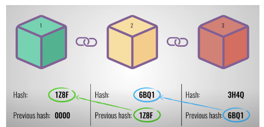

# 블록체인(Blockchain)이 뭐죠?
1991년 최초로 발표된 블록체인(Blockchain)은  
P2P* 네트워크로 관리되는 분산 데이터베이스의 한 형태다.  

유형 자산(주택, 차, 현금 등) 또는 무형 자산(지식재산권, 저작권, 특허 등)을  
거래한 정보를 담은 장부를 여러 곳에 나눠 저장할 수 있는 기술이다.  

\*P2P(Peer To Peer): 클라이언트나 서버라는 개념 없이, 개인 컴퓨터들이  
서로 클라이언트와 서버의 역할을 하면서 정보를 공유하는 방식을 말한다.

중앙 서버 한 곳에 장부를 저장하는 기존 거래 방식과 달리,  
블록체인 네트워크에 연결된 여러 컴퓨터에 장부를 저장 및 보관한다.  
블록체인의 '블록'이 바로 거래 데이터가 기록되는 장부인 것이다.

이 블록이 여러 개 형성되면 시간의 흐름에 따라 연결되어 '체인(사슬)'의 구조를 띠게 된다.  
해당 네트워크에 연결된 컴퓨터는 각각 장부를 보유하고 있기 때문에,  
장부의 데이터를 확인하려면 모든 사용자의 장부를 대조하고 확인하는 과정이 필요하게 된다.

이 때문에 블록체인은 분산원장 기술(DLT, Distributed Ledger Technology)이라고도 불린다.  
분산원장 기술은 거래 정보를 기록한 장부 데이터를 중앙 서버에 두는 것이 아니라, 
참여자들이 공동으로 기록하고 관리하는 것을 의미하고 있어요.  
그리고 블록체인 네트워크에 들어온 참여자들을 노드(Node)라고 한다.

# 블록체인의 핵심 특징
## 1. 위변조가 어렵다

블록체인의 각 블록엔 데이터(Data), 데이터의 해시값, 직전 블록의 해시값이 들어있다.  
데이터는 거래 내역의 장부 내용이에요.  
예를 들면, 거래자의 이름, 거래 금액, 거래 날짜 등의 정보 등이 될 수 있다.

해시(Hash)는 어떤 문자열을 더 짧은 길이의 값이나 키로 변환한 것으로,  
다양한 길이의 데이터를 고정된 길이의 데이터로 바꾼 값을 의미한다.  

예를 들면, 거래자 A와 B가 어떤 거래를 진행하며  
작성한 장부 내용(거래 날짜, 거래 물품, 거래자의 이름 등의 긴 정보)을  
'1234A'와 같은 짧은 문자로 저장하는 식이에요. 

이 해시값은 특정 블록을 식별할 수 있는 값인데,  
사람의 지문과 비슷하다.  
모든 블록은 각각 해시값을 가지고 있고,  
블록의 데이터에 변화가 있을 경우엔 해시값이 완전히 새롭게 바뀐다.

하나의 블록 안에는 해당 블록의 해시값과  
직전에 생성된 블록의 해시값이 모두 들어있다.  

블록 1과 블록 2가 있다고 가정했을 때,  
블록 1의 데이터를 변경하면 그 블록의 해시값은 변경되기 때문에  
그 블록과 이어진 블록 2는 무효화 됩니다.  
블록 2에 저장된 직전 블록(블록 1)의 해시값과 블록 1의 해시값이 일치하지 않기 때문이다.

블록에는 직전 블록의 해시값이 있고,  
직전 블록과 연결되기 때문에 해시가 체인의 역할을 하는 거라고 볼 수 있다.  
그리고 블록체인의 이런 특성 때문에  
한 번 입력된 데이터는 변경하기가 매우 힘들다.

모든 블록엔 그 블록의 해시값과 이전 블록의 해시값이 들어있다.  
이미지의 2번 블록에서 2번 블록의 해시값과  
이전 블록인 1번 블록의 해시값을 모두 가지고 있는 것처럼 말이다.  

## 2. 보안성이 높다

앞서 언급했듯 블록체인은 데이터를 분산저장하고 있습니다.  
특정 블록체인 네트워크의 구성원이라면 언제나 정확한 데이터를 받을 수 있다.   
그리고 여러 사람이 같은 데이터를 저장하기 때문에 위변조가 어렵다.  
블록체인의 이런 성격들은 높은 보안성으로 이어진다.

중앙 서버 한 곳을 두는 기존 거래 방식의 경우,  
중앙 서버만 공격하면 데이터를 위조나 변조하는 것이 가능하다.  

하지만 블록체인 네트워크를 위변조하기 위해선  
해당 네트워크 참여자의 데이터를 모두 공격해야 하기 때문에 사실상 해킹이 불가능하다고 한다.  
기존의 중앙집중 서버 방식에서 가장 큰 문제인 디도스 공격\*을 방어할 수 있게 된 것이다.

\*디도스 공격(Distributes Denial of Service attack, DDoS Attack): 분산 서비스 거부 공격인  
디도스 공격은 웹사이트나 네트워크 운영이 불가능하도록 악성 트래픽을 대량으로 보내는 공격이다.

웹사이트를 마비시키기 위해 여러 클라이언트를 동원해  
과도한 트래픽을 풀어 서버에 무리를 준다.  

디도스 공격이 발생하면 정상 사용자가 서비스를 이용하거나  
접속을 시도하는 것이 불가능하게 된다.

블록체인의 높은 보안성 때문에  
데이터 원본의 무결성이 중요한 은행이나 정부 기관에서 많이 활용되고 있다.  

은행을 예시로 생각해보면 기존 방식의 경우엔  
중앙 서버인 은행이 모든 거래 내역을 보관하고 있다.  
A라는 사람이 B라는 사람에게 1만 원을 송금한다고 할 때,  
A가 B에게 돈을 보냈다는 사실을 은행이 증명해주는 것이다.

블록체인의 경우엔 거래 내역을 네트워크에 참여하고 있는 참여자 모두가 저장한다.  
A와 B가 1만 원을 거래한 내역을 네트워크 참여자 수만큼 블록을 생성해서 전달하는 것이다.  
장부를 분산저장 함으로써 거래 내역을 투명하게 유지할 수 있다.

## 3. 효율이 높다

블록체인은 거래 내역을 저장한 데이터를 저장하는 것은  
물론 거래 계약도 중간 담당자 없이 진행할 수 있다.

일명 스마트 계약(Smart Contract)이라고 하는데,  
일련의 규칙들을 블록체인에 저장하고 자동으로 실행하는 방식이다.  
이렇게 비즈니스 계약을 자체적으로 관리할 수 있게 된다.

블록체인을 통하면 여러 과정을 생략할 수 있기 때문에  
거래 과정에서 발생하는 운영상의 병목 현상을 줄일 수 있다. 

거래 과정의 비용을 절약할 수 있고, 거래를 가속화할 수 있게 된다.  
블록체인 시스템은 거래 기록을 위한 규칙을 설정하고   
네트워크 참여자의 50% 이상이 동의한 경우에만 새로운 거래를 기록할 수 있다.  
그렇게 때문에 기록을 조정하느라 낭비되는 시간을 줄일 수 있다고 한다.

## 떼려야 뗄 수 없는 둘
블록체인과 암호화폐(feat. 비트코인)
블록체인 하면 비트코인이 가장 먼저 떠오르는 이유는 뭘까?  
비트코인과 같은 암호화폐의 등장이 블록체인 덕분이었다.

블록체인을 사용하면 중앙 서버의 개념이 없어지기 때문에,  
은행이라는 중앙서버가 없더라도 화폐를 발행하는 게 가능하다. 

비트코인 역시 나카모토 사토시라는 한 개발자가 비트코인이라는 네트워크를 만들었을 뿐,   
화폐를 발행하거나 네트워크를 관리하는 역할까지 하진 않는다.  
화폐를 원하는 사람들이 직접 '채굴(Mining)'해서 발행하는 방식이다.

 
비트코인(Bitcoin)이라는 명칭은 컴퓨터 단위인 비트(Bit)와 화폐를 뜻하는 코인(Coin)의 합성어라고 한다.

새로운 블록이 블록체인에 추가되기 위해선  
이전 내용에 변경이나 위조가 없는지 확인하는 과정이 필요하다. 

하지만 중앙 서버가 없는 블록체인 네트워크에선  
확인 작업을 해줄 관리자가 존재하지 않는다.  

그래서 이런 작업을 할 때 작업을  
희망하는 참여자의 컴퓨터 자원(전기, CPU 등)을 쓰게 된다.   
참여자는 블록 생성을 위한 확인 과정을 작업해준 보상으로  
비트코인과 같은 암호화폐를 받게 된다.

암호화폐는 중앙 서버 없이도 화폐를 발행하고  
유통하는 것이 가능하다는 것을 보여준 사례다.   
일각에서는 블록체인이 중앙기관과 은행을 대체할 것이라는  
다소 극단적으로 전망하기도 했다.  
하지만 암호화폐의 투기성 등의 부작용도 꾸준히 지적되고 있다.

# 암호화폐에서 NFT까지 💸

암호화폐는 누구나 쉽게 거래할 수 있고, 거래 내용을 블록체인에 기록할 수도 있다.  
또한, 한 블록체인 네트워크에서의 화폐는 전부 동일한 가치를 가진다.  
내가 가진 1비트코인과 다른 사람이 가진 1비트코인의 가치가 동일한 것처럼 말이다.  
그래서 암호화폐는 대체 가능한 토큰, FT(Fungible Token)이다.

그런데 각각의 암호화폐를 구분할 수 있다면 어떨까요? 그 화폐가 누구의 것인지 증명할 수 있게 된다.  
이렇게 대체 불가능한 토큰인 NFT(Non-Fungible Token)가 등장했다.

# 다양하게 활용되는 블록체인

## 1. 저작권 데이터 관리

미디어 혹은 엔터테인먼트 업계에서는 저작권 확인이 특히 중요하다.  
저작권은 눈에 보이지 않지만,  
콘텐츠를 만든 주인에게 올바른 보상을 하기 위해선 저작권 확인이 꼭 필요하다.  
저작권이 있는 콘텐츠를 팔거나 양도하려면 여러 가지 거래가 필요한데,  
일본의 소니 뮤직 엔터테인먼트(Sony Music Entertainment Japan)에선  
블록체인 서비스를 사용해서 디지털 저작권을 관리하고 있다.

블록체인 네트워크를 통해 음악의 저작권을 확인하는 데 필요한 거래 수를 크게 줄였다고 한다.  
또한 블록체인을 변경하는 것이 어렵기 때문에 거래마다  
당사자가 직접 만나지 않고도 거래의 유효성을 확인힐 수 있다고 한다.

## 2. 식품 원산지 추적

세계의 유통시장이 블록체인 기술을 도입해오고 있어요.  
세계 최대 유통기업인 월마트(Walmart)는  
인증 관리 시스템에 의해 허가된 사용자만 참여할 수 있는  
하이퍼레저 패브릭(Hyperledger Fabric) 블록체인을 도입했다.

월마트는 식품을 납품하는 농장, 보관 창고,  
운송 경로 전체에 사물인터넷(IoT) 센서를 설치해 데이터를 수집했다.  

식품의 원산지, 보관 온도, 유통기한 등 모든 유통 과정과  
정보를 실시간으로 업데이트하고 소비자들에게 공개했다. 

소비자는 QR 코드를 통해 해당 식품의 정보를 빠르게 확인할 수 있게 되었다.  
월마트는 블록체인을 통해 식품 품질을 개선하는 데 많은 도움을 받게 되었다고 한다.

## 3. 안전한 중고 거래

중고 거래에서 가장 중요한 것은 판매자와 구매자 사이의 신뢰다.  
하지만 돈을 내고도 물건을 제대로 받지 못하거나 물건을 보내고    
돈을 못 받는 경우가 많아요. 위험한(?) 중고 거래를 안전하게 하기 위해서도  
블록체인이 활용될 수 있다고 한다.

2022년 9월, 신한카드는 번개장터와 함께 블록체인 기술을 기반으로 한  
'디지털 워런티(Digital Warranty)' 서비스를 시범적으로 오픈했다.

디지털 워런티 서비스는 거래되는 상품이 정품인지 블록체인을 통해 인증해주는 서비스다.  
제품의 시리얼 넘버, 상품 정보, 감정사 정보 등을 포함하고 있으며,  
구매자가 제품 안내서의 QR 코드를 스캔하면 발급받을 수 있다.  
해당 서비스는 2022년 연말까지 한정적으로 운영 후 종료되었다고 .

# 참조
* [인프런 - 세리](https://www.inflearn.com/pages/infmation-57-20230117?utm_source=oneoneone)
