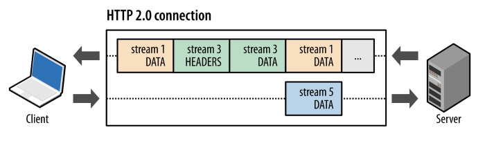
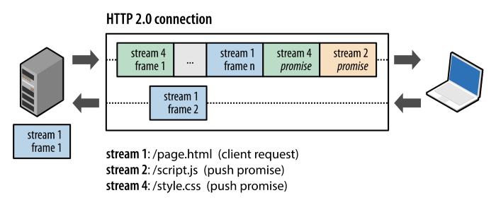
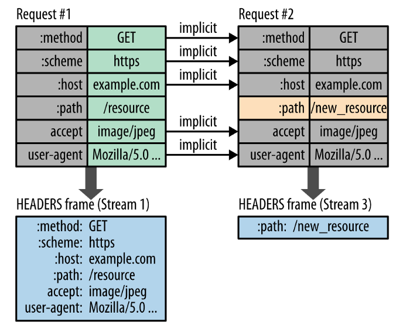

# HTTP / 0.9
 HTTP의 시작은 1989년 팀 버너 리(Tim Berners-LEE)에 의해 제안된 인터넷의 하이퍼 텍스트 시스템이다.

초기 버전인 HTTP/0.9는 매우 단순한 프로토콜이었다.

가능한 메서드는 하이퍼텍스트 문서(html)를 가져오기만 하는 GET 동작이 유일했으며,   
헤더(header)도 없어 요청과 응답이 극히 단순 명료 하였다. 또한 상태 코드(status code)도 없었기 때문에   
문제가 발생한 경우 특정 html 파일을 오류에 대한 설명과 함께 보내졌다.

## HTTP 0.9 스펙을 요약하면 다음과 같다.
* TCP/IP 링크 위에서 동작하는 ASCII 프로토콜  
* Get 메서드만 지원  
* HTTP 헤더 X, 상태 코드 X  
* 응답도 HTML 파일 자체만 보내줌  
* 서버와 클라이언트 간의 연결은 모든 요청 후에 닫힘(closed)  
* 사실 초기에는 버전 번호가 존재하지 않았지만, 이후에 다른 http 버전들과 구분하기 위해서 0.9라는 버전을 붙이게 되었다고 한다.

HTTP는 이러한 비교적 단순한 형태로 1991년에 시작되어, 이후 빠르게 진화하고 발전하게 되어지기 시작 했다.

# HTTP 1.0 스펙
1. 기본적인 HTTP 메서드와 요청/응답 헤더 추가  
2. HTTP 버전 정보가 각 요청 사이내로 전송되기 시작 (HTTP/1.0 이 GET 라인에 붙은 형태로)  
3. 상태 코드(status code)가  응답의 시작 부분에 붙어 전송되어, 브라우저가 요청에 대한 성공과 실패를 알 수 있고 그 결과에 대한 동작을 할 수 있게 되었다. (특정 방법으로 로컬 캐시를 갱신하거나 ..등)
4. 응답 헤더의 Content-Type 덕분에 HTML 파일 형식 외에 다른 문서들을 전송하는 기능이 추가되었다.
5. 단기커넥션 : connection 하나당 1 Request & 1 Response 처리 가능

## Http 1.0의 문제
모든 애플리케이션이 다음 릴리즈를 출시하는 이유가 있듯 Http2도 기존 버전의 Http가  
해결할 수 없는 이러 저러한 문제를 해결하기위해 고안되었습니다.

시간이 지날 수록 서버들은 큰 용량의 리소스를 제공하고 네트워크의 규모와 성능이 나날이 좋아지는 만큼  
Http1은 이전에 없던 다음과 같은 문제를 직면 했습니다.

* 요청마다 필요한 무거운 Tcp Connection  
* 첫번째 패킷의 Resolve를 기다리는 Head Of Line Blocking  
* 무거운 헤더 사이즈 Heavy Header  

# HTTP 1.1 스펙
* 지속 연결(Persistent connection) : 지정한 timeout 동안 연속적인 요청 사이에 커넥션을 닫지 않음.  
  * 기존 연결에 대해서 handshake 생략 가능
* 파이프 라이닝(pipelining) : 이전 요청에 대한 응답이 완전히 전송되기 전에 다음 전송을 가능하게 하여,   
  * 여러 요청을 연속적으로 보내 그 순서에 맞춰 응답을 받는 방식으로 지연 시간을 줄이는 방식 (불안정하여 사장됨)
* HOST 헤더 추가 : 동일 IP 주소에 다른 도메인을 호스트하는 기능 가능
* Chunk Encoding 전송 : 응답 조각
* 바이트 범위 요청
* 캐시 제어 메커니즘 도입

## HTTP/1.1의 문제점

### HOLB(Head Of Line Blocking)

HTTP 요청을 할 때는 요청을 하고 나서 응답이 와야 다음 요청을 할 수 있었는데 HTTP/1.1에 들어오면서  
파이프라이닝(Pipelining) 기법을 통해 응답을 받지 않고도 여러개의 요청을 연속적으로 할 수 있게 되었다.  
하지만 이 또한 처음의 요청에 대한 응답이 오래 걸리는 경우, 그 다음 응답까지의 시간이 지연되는 현상이 발생한다.  
이렇게 파이프라이닝 기법은 심각한 문제를 안고 있었으며 이를 Head of Line Blocking 문제라고 부른다.

### 무겁고 중복 많은 헤더 구조
요청을 할 때 요청헤더에 메타정보를 넣어서 보내게 되는데,  
매 요청마다 보내는 정보가 많아져서 헤더가 무거워지고  
쿠키 같은 경우는 계속 보내게 되기 때문에 중복도 많아지는 문제가 있다.

### HTTP/2가 나오기 전의 개선방법들
* CSS/JavaScript/이미지 압축
* Data URI 스키마(이미지를 이진 파일로 바꿔 HTML에 넣어놓는 기법)
* Image Sprite(여러개의 작은 이미지들을 1번의 요청으로 받아오는 기법)
* 도메인 샤딩(1개의 도메인을 여러개의 서브도메인으로 나눠서 병렬요청하는 기법)
* 스크립트 파일을 `</body>` 직전에 배치해서 HTML/CSS 파싱 중단 안되게 설정

# HTTP 2.0의 특징
## 다중화 (multiplexing)
다중화는 네트워크 용어로 여러 데이터를 하나의 결합된 데이터로 보낸다는 의미를 내포하고 있습니다.

Http2 관점에서 볼때 위에서 설명한 Binary Framing 계층의 여러 Headers, Data 프레임이 하나의 TCP 연결에 결합되어 전송됩니다.

Http1에선 개별 Frame 마다 비싼 비용의 TCP 연결이 생성 되었으니 주목할만한 개선이라고 볼 수 있지요.  
이를 자세히보면 다음과 같은 절차로 전송됩니다.

* Http 메시지를 독립된 프레임으로 세분화
* 이 프레임을 우선순위에 맞게 TCP 연결에 끼워넣는다 (인터리빙)
* 수신 채널에서 이를 프레임을 재 조립하여 Http 메시지로 가공

이렇게 프레임을 다중화하여 TCP 연결을 최소화하는것이 Http2 성능 최적화에 핵심이라고 볼 수 있습니다.

## 서버 푸시
다중화와 더불어 Http2에서 주목할만한 개선은 서버 푸시입니다.

단일 요청에 대한 복수 응답을 의미하는 개념인데 이는 기존의 비슷한 동작을 구현하기위해  
필요했던 비싼 비용의 소켓, 폴링, 스트리밍과 같은 기술들과 구분됩니다.

단지 한번의 요청이면 됩니다.

서버는 어떤 리소스가 클라이언트에 필요한지 이미 알고 있습니다.

이러한 개념을 이용해 한꺼번에 리소스를 제공한다면 불필요한 TCP 연결을 최소화할 수 있지요.

또한 원하지 않는 리소스를 클라이언트가 제어할 수 있도록 SETTINGS 프레임을 정의할 수 있습니다.

## HPACK 압축
HPACK 압축은 이전에 없던 새로운 압축 알고리즘이 아니라 Http2에서 주고받을 헤더의 사이즈를 줄이기 위해 명명된 기술 이름입니다.

HPACK은 크게 Huffman Code를 이용한 무손실 압축, Header Indexing 등의 최적화를 포함하고 있습니다.

Huffman Code 무손실 압축은 위키피디아의 설명으로 대체하고 Header Indexing은 다음과 같은 원리로 이루어집니다.

* 이전에 표시된 헤더의 색인 목록을 클라이언트와 서버가 유지
* 새로 추가된 헤더에 대해서만 압축되어 포함

# 결과
여러 아티클과 조사한 자료들에 따르면 Http1 대비 Http2의 성능수준이  
리소스 구조에 따라 최소 14% ~ 40% 정도의 개선을 말하고 있습니다.  

Http2는 확실히 Http1보다 좋고 빠릅니다.  
또한 대부분의 브라우저와 웹서버가 안정화된 기능(Stable Feature)으로 이를 지원하고 있습니다.   

# 출처
[https://inpa.tistory.com/entry/WEB-%F0%9F%8C%90-HTTP-09-HTTP-30-%EA%B9%8C%EC%A7%80-%EC%95%8C%EC%95%84%EB%B3%B4%EB%8A%94-%ED%86%B5%EC%8B%A0-%EA%B8%B0%EC%88%A0

[JK](https://velog.io/@jeonjay/%EB%AA%A8%EB%91%90%EB%A5%BC-%EC%9C%84%ED%95%9C-http2)
