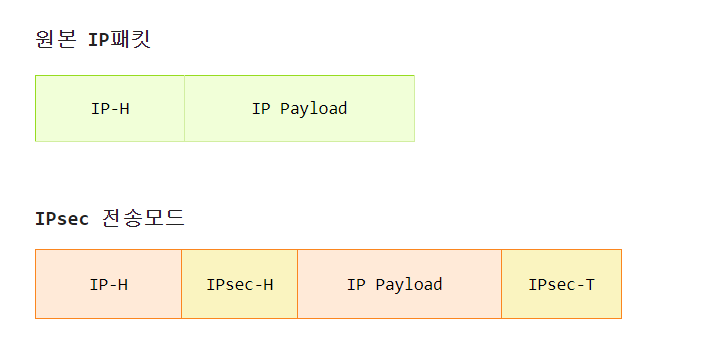
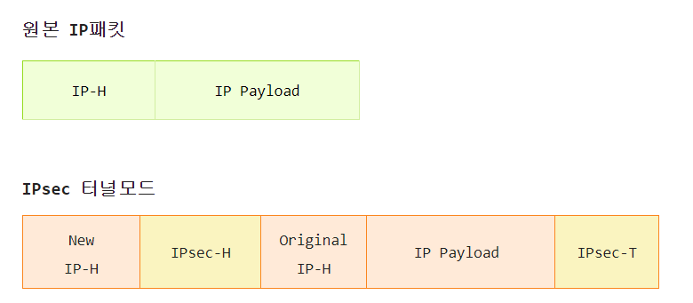
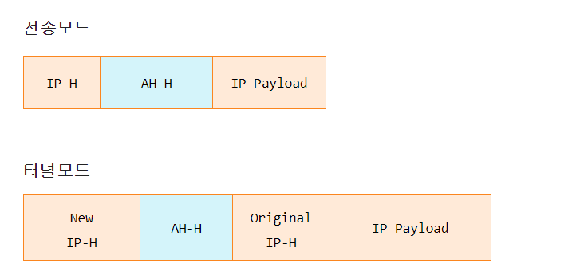
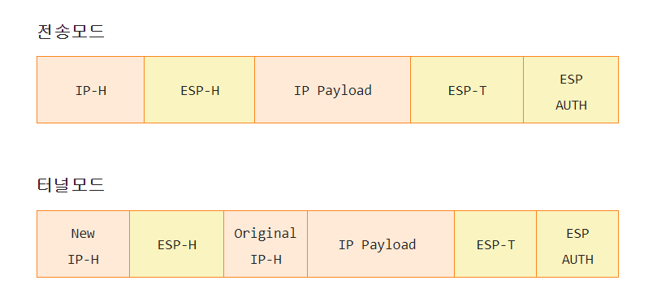

# IPsec (IP Security) 란?
End Point 또는 보안/터널 게이트웨이(라우터, 방화벽, VPN 등) 구간에  
IP패킷 보안 서비스를 제공해주는 네트워크 계층 프로토콜 

IETF(국제 인터넷 기술 위원회)에서 IP보안을 위하여 개방형 구조로  
설계한 표준으로 IP계층 보안에 대해서 안정적이고 표준화된 기초를 제공한다.

IP 계층에서 직접 보안 서비스를 제공함에 따라 상위 계층 프로그램의 변경이 필요하지 않다.

차세대 인터넷 프로토콜인 IPv6에서 IPsec을 기본적으로 포함하고 있다.

# 보안서비스 제공 (RFC2401 표준 정의)
1. 기밀성 (Confidentiality)
    - 대칭 암호화를 통해 기밀성을 제공. 단, AH 프로토콜은 암호화를 지원하지 않으며 ESP 프로토콜만 암호화를 지원

2. 비연결형 무결성 (Connectionless Integrity)
    - 메시지 인증 코드(MAC : Message Authentication Code)를 통해 각 IP 패킷별로 무결성 보장
    - 송신측에서 인증 데이터 / MAC 값을 계산하여 전송하고 수신측에서 이를 검증한다.

3. 데이터 원천 인증/송신처 인증 (Data Origin Authentication)
    - 메시지 인증 코드를 통해 IP 패킷이 올바른 송신처로부터 온 것임을 보장해준다.

4. 재전송 공격 방지 (Protection Against Replays)
    - 송신측에서 IP 패킷별로 순서번호(Sequence Number)를 전송하고 수신측에서 해당 보안연관  
      (SA : Security Association)에 순서번호를 유지하고 이를 검증함으로써 재전송 공격을 방지한다.

5. 접근 제어 (Access Control)

    - 보안 정책을 통해 송수신 IP패킷에 대한 시스템 접근을 제어한다.
    - 접근 제어 방식은 IP 패킷의 허용, 폐기, 보호 등이 있다.

6. 제한된 트래픽 흐름의 기밀성 (Limited Traffic Flow Confidentiality)

    - ESP/터널모드의 경우 New IP헤더를 통해 터널 / 보안 게이트웨이 구간의 트래픽 흐름 정보는 노출되지만 원본 IP 헤더는 암호화되어 있기 때문에 터널/보안 게이트웨이와 종단 노드 구간의 트래픽 흐름의 기밀성은 보장된다.x

# IPsec 동작 모드

## 1. 전송모드

- IP 패킷의 페이로드를 보호하는 모드, 즉 IP의 상위 프로토콜 데이터를 보호하는 모드이다.

- IP 패킷의 페이로드만 IPsec로 캡슐화하고 IP헤더는 그대로 유지하므로 네트워크상 패킷전송에 문제가 발생하지 않는다.

- IP 헤더를 보호하지 않기 때문에 트래픽 흐름(최초 출발지 및 최종 목적지)이 분석될 수 있다.

- 일반적으로 End Point 구간의 IP 패킷 보호를 위해 사용한다.

## 2. 터널모드

- IP패킷 전체를 보호하는 모드

- IP패킷 전체를 IPsec로 캡슐화하여 IP 헤더를 식별할 수 없기 때문에 네트워크상 패킷 전송이 불가능하다. 따라서 전송구간 주소 정보를 담은 New IP헤더를 추가한다.

- 원본 IP 헤더를 보호하기 때문에 최초 출발지 및 최종 목적지에 대한 트래픽 정보의 기밀성을 보장해준다.

- 새로운 IP 헤더를 통해 보안/터널 게이트웨이 구간 정보는 노출될 수 있기 때문에 제한적 트래픽 흐름의 기밀성을 보장해준다.

- 일반적으로 터널/보안 게이트웨이 구간 또는 종단 노드와 터널/보안 게이트웨이 구간의 IP 패킷 보호를 위해 사용

- 터널/보안 게이트웨이 구간 IP 패킷 보호는 물리적으로 떨어진 위치의 본점, 지점 사이에 다수의 사용자 호스트와 서버로 구성된 VPN 환경을 예로 들 수 있다.

# IPsec 세부 프로토콜
## 1. AH(Authentication Header) 프로토콜

- 메시지 인증 코드(MAC)를 이용하여 인증을 제공해주는 프로토콜로 기밀성은 제공하지 않는다.

- 송신측에서 MAC 알고리즘과 인증키를 통해 인증 데이터를 계산하여 전송하고 수신측에서 이를 검증한다.

- 인증 데이터 계산에는 IP헤더의 변경 가능한 필드를 제외한 IP패킷 전체를 대상으로 한다.

- 동적으로 변경되는 필드를 인증 데이터 계산에 포함할 경우 수신측 검증 시 인증 데이터가 일치하지 않아 인증에 실패하므로 변경되는 필드를 제외하고 인증 데이터를 계산한다.

- IP 헤더의 전송 중 변경 가능한 필드는 TTL, Header Checksum, NAT 환경에서의 Source IP 등이 있다.

### AH 프로토콜 동작 모드

- 전송모드는 IP 헤더의 전송 중 변경 가능한 필드를 제외한 IP패킷 전체를 인증한다.

- 터널 모드는 New IP 헤더의 전송 중 변경 가능한 필드를 제외한 New IP 패킷 전체를 인증한다. 

- AH 프로토콜은 암호화를 지원하지 않기 때문에 ICMP 메시지가 평문으로 전송된다.

## 2. ESP(Encapsulating Security Payload) 프로토콜
- MAC와 암호화를 이용하여 인증과 기밀성을 제공한다.
- 인증과 암호화를 선택적으로 적용할 수 있다. 즉, 인증만 적용하거나 인증+암호화를 적용할 수 있다.
- 인증에 있어서 AH 프로토콜과의 차이점은 AH는 변경 가능한 IP 헤더 필드를 제외한 IP 패킷 전체를 인증하지만 ESP는 IP 헤더를 인증하지 않는다.

### ESP 프로토콜 동작모드

- 전송모드는 IP 페이로드와 ESP 트레일러를 암호화하고 암호화된 데이터와 ESP 헤더를 인증한다.
- 터널모드는 원본(Original) IP 패킷 전체와 ESP 트레일러를 암호화하고 암호화된 데이터와 ESP 헤더를 인증한다.

 # 출처
 [itragdoll Tistory](https://itragdoll.tistory.com/m/52)
