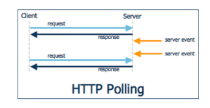
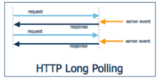
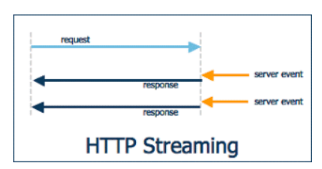
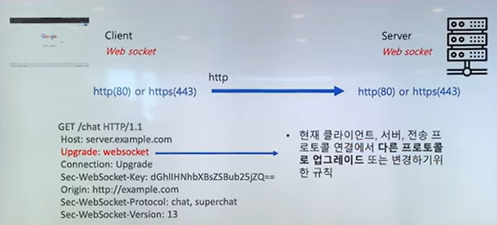
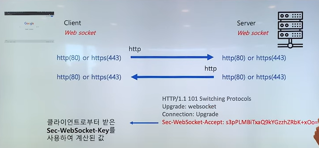
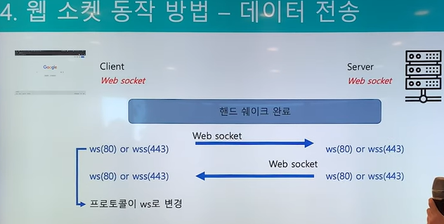
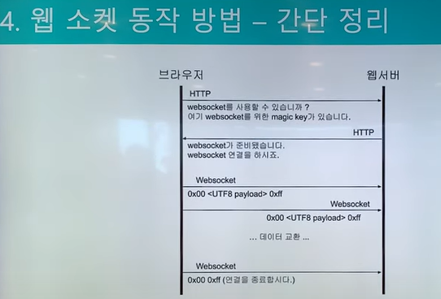

# HTTP 통신 vs Socket 통신
통신을 하는데 있어서 다음과 같이 크게 두 가지로 나눌 수 있다.

## HTTP와 Socket의 가장 큰 차이점
접속(Connection)을 유지하는지의 여부이다.

HTTP는 비연결지향성 프로토콜이다.

# 웹 소켓 이전의 비슷한 기술 
## 1. Polling

가장 기본적인 데이터 처리방식으로, 특정 주기를 가지고 서버에 http request을 하는 방식이다.

Polling방식은 언제 통신이 발생할 지 예측이 불가능하기 때문에 클라이언트가  
평범한 http request를 일정한 주기로 서버에 요청하여 이벤트 내용을 전달받는 방식이다.

가장 간단한 방법이지만 언제 통신이 발생할지 예측이 불가능하다는 점에서  
클라이언트가 계속적으로 요청을 하기때문에 클라이언트가 많아지면 서버의 부담이 급증하게된다.  
실시간 통신이라고 부르기는 하지만 실시간 정도의 빠른 응답을 기대하기는 어렵다.

## 2. Long Polling

Polling과 비슷한 기법이나 실시간으로 데이터를 처리할 수 있는 방식이다

Long Polling은 클라이언트에서 서버로 일단 http request를 보내고 이 상태로 계속 기다리다가  
서버에서 해당 클라이언트로 전달할 이벤트가 있다면 그 순간 response 메세지를 전달하며 연결이 종료된다.  
해당 작업이 완료된 이후에는 클라이언트에서 곧바로 다시 http request를 보내 서버의 다음 이벤트를 기다리게 되는 작업 방식이다.

일반 Polling과 비교했을때 Polling보다는 서버의 부담이 줄어든다는 장점이 있지만  
클라이언트에게 동시에 많은 양의 메세지가 올 경우 Polling과 별 차이가 없게되며,  
다수의 클라이언트에게 동시에 이벤트가 발생될 경우에는 곧바로 다수의 클라이언트가  
서버로 접속을 시도하게 되면서 서버의 부담이 급증하게 된다.

## 3. Streaming

일반적인 TCP Connection과 비슷하며, 클라이언트와 서버간 연결 된 연결 통로로 데이터를 보내는 방식이다

Streaming은 Long Polling과 마찬가지로 처음에는 클라이언트에서 서버로 http request를 보낸다.

서버에서 클라이언트로 이벤트를 전달할 때, 해당 요청을 끊지 않고 필요한 메세지만 보내기를 반복하는 방식이다.  
서버에서 메세지를 보내고 나서 다시 http request연결을 하지 않아도 되어 Long Polling에 비해 부담이 덜 하다.

## 한계점과 해결책은?
세 가지 방법 모두 Http를 통해 통신하기 때문에 요청과 응답시 둘 다 Header가 불필요하게 크다는 단점이 있다.

또한 Long Polling과 Streaming 방식의 경우 서버에서 클라이언트로 메세지를 보낼수는 있지만  
클라이언트에서 서버로 메세지를 보내는것에는 조금 어렵다는 문제점이 있다.

그래서 이렇게 약간의 문제가 있는 기술들 말고 정식으로 클라이언트와 서버간에 어려움 없이  
양방향으로 통신이 가능하게 하기 위해서 HTML5 표준의 일부로 Web Socket이 만들어지게 되었다.

# 웹소켓이란?
* W3C와 IETF에 의해 자리잡은 표준 프로토콜 중 하나
* IETF: 인터넷의 운영, 관리, 개발에 대해 협의하고 프로토콜과 구조적인 사안들을 분석하는 인터넷 표준화 작업 기구
* 현재 인터넷 환경(HTML5)에서 많이 사용된다.

## 웹 소켓의 특징
1. 양방향 통신: 데이터 송수신을 동시에 처리할 수 있는 통신 방법
2. 실시간 네트워킹: 웹 환경에서 연속된 데이터를 빠르게 노출

## 웹 소켓방식 - 핸드쉐이킹

* Connection: Upgrade
  * Upgrade 헤더 필드가 명시되었을 경우 송신자는 반드시 Upgrade 옵션을 지정한 Connection 헤더 필드로 전송
* Sec-Websocket-key: 길이가 16바이트인 임의의 선택된 숫자를 base64로 인코딩한 값
* origin: 클라이언트로 웹 브라우저를 사용하는 경우에 필수항목으로, 클라이언트의 주소
* Sec-WebSocket-Protocol: 클라이언트가 요청하는 여러 서브 프로토콜을 의미

* Sec-WebSocket-Accept: 클라이언트로 부터 받은 Sec-WebSocket-Key를 사용하여 계산된 값
 * 클라이언트에서 계산한 값과 일치하지 않으면 연결 수립되지 않는다.
 
 
 ## 웹 소켓방식 - 데이터 전송
 
 
 * ws: 프로토콜이 ws로 변경
 * wss: 데이터 보안을 위해서 SSL을 적용한 프로토콜
 * message: 여러 frame이 모여서 구성하는 하나의 논리적 메세지 단위
 * frame: communication에서 가장 작은 단위의 데이터 + payload로 구성
 * 웹소켓 통신에 사용되는 데이터는 UTF8 인코딩

 ## 웹 소켓방식 - 간단 정리
 

* 최초 접속에서만 http 프로토콜 위에서 handshaking을 하기 때문에 http header를 사용한다.
* 웹 소켓을 위한 별도의 포트는 없으며, 기존 포트(http-80, https-443)을 사용
* 프레임으로 구성된 메시지라는 논리적 단위로 송수신
* 메시지에 포함될 수 있는 교환 가능한 메시지는 텍스트와 바이너리

## 웹 소켓의 한계
* Web Socket은 문자열들을 주고 받을 수 있게 해줄 뿐 그 이상의 일을 하는 것은 아니다.
* 주고받는 문자열의 해독은 온전히 애플리케이션에 맡긴다。
* HTTP는 형식을 정해두었기 때문에 모두가 약속을 따르기만 하면 해석할 수 있다
* 하지만 WebSocket은 형식이 정해져 있지 않기 때문에 어플리케이션에서 쉽게 해석하기 힘들다。
* 때문에 Web Socket 방식은 sub-protocols을 사용해서 주고받는 메시지의 형태를 약속하는 경우가 많다。

## Socket.io, SockJS
* HTML5 이전의 기술로 구현된 서비스에서 웹소켓처럼 사용할 수 있도록 도와주는 기술
* Javascript를 이용하여 브라우저 종류에 상관없이 실시간 웹을 구현
* Web Socket,FlashSocket,AJAX Long Polling,AJAX Mufti part Streaming,IFrame, JSONP Polling을 하나의 API로 추상화
* 즉，브라우저와 웹서버의 종류와 버전을 파악하여 가장 적합한 기술을 선택하여 사용하는 방식

# 참조

