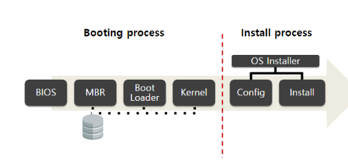
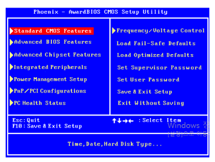
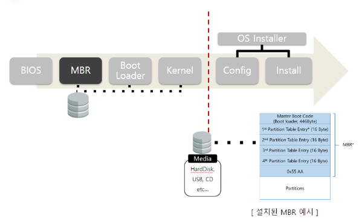
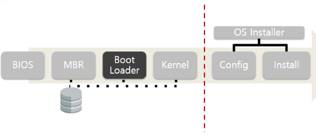
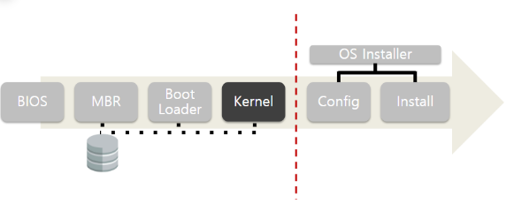
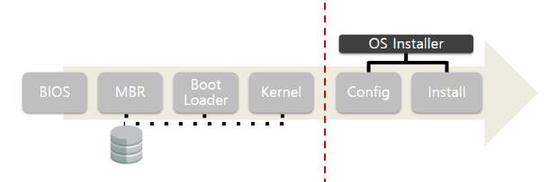
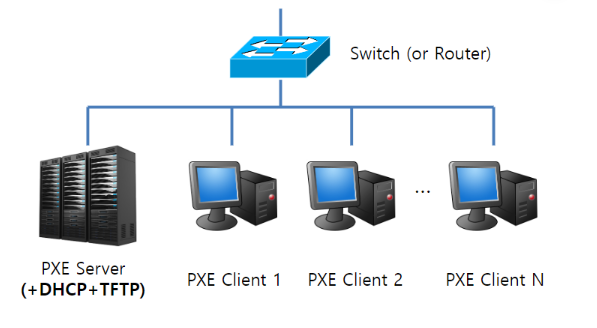
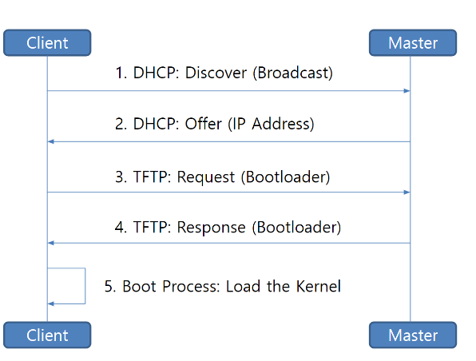

# 1. OS 설치 과정

PXE 부팅에 대해 소개하기 전에 일반적으로 OS 설치하게 되었을 때 내부적으로 동작하는  
rocess Flow에 대해서 이해하고 넘어가도록 하자.  
OS 설치 과정은 크게 부팅 프로세스와 인스톨 프로세스로 구분되며 세부적으로는  
BIOS->MBR->Boot Loader->Kernel->Confiugration->Install 단계로 설치가 수행된다.

## (1) BIOS
* Basic IO System
* 컴퓨터의 전원이 공급되면 시작되는 최초의 프로그램
* 컴퓨터는 BIOS의 설정에 따라 부팅 절차에 수행할 하드웨어의 우선순위를 지정하게 됨
* OS 설치 시에는 BIOS 설정에서 OS 설치 데이터가 들어 있는 CD나 USB를 최우선 순위로 둠으로써 부팅을 수행

BIOS 화면

## (2) MBR

* 부팅 모드 (Legacy/UEFI)에 따라 접근 방식에 차이가 있으나 Legacy 모드를
* Master Boot Record
* Disk 의 첫 512byte
* Boot loader 가 적재되어 있음
* 설치시, MBR 이 기록된 USB 등 을 이용

## (3) Boot Loader

* 운영 체제가 시동되기 전, 커널이 올바르게 시동되기 위한 작업을 수행하는 프로그램
* BIOS로 부터 메모리에 적재되어 실행
* Kernel 을 메모리에 적재함
* e.g. ISOLINUX, PXELINUX, GRUB

## (4) Kernel

* 운영 체제의 핵심 프로그램
* 하드웨어 제어, 시스템 자원 관리 등을 담당
* 커널이 RAMDISK에 올라가게 되면 해당 커널 이미지를 이용하여 OS 설치 작업을 수행

## (5) OS Installer

* OS를 하드디스크에 설치하는 프로그램
* 사용자로부터 설정을 입력받아 Configuration 진행

### (a) Config

* 운영체제 설치 전, 필요한 설정값 입력
* 언어, 지역, 파티션, 패키지 등 설정

### (b) Install
* 입력받은 설정에 따라 OS 를 설치
* 커널 바이너리, 부트로더, 패키지 파일들을 하드디스크에 복사

# 2. 기존 OS 설치 과정의 문제점
기존 OS 설치 방법 (e.g. CD-ROM, USB 등)은 대규모 서버 구축 과정에 있어 부적합

## (1) Concurrency Problem
다수의 원격 노드에 OS를 병렬로 설치하는데 한계 존재  
병렬 설치를 위해서는 그에 해당하는 수의 설치 Device가 필요

## (2) Configuration Problem
각 OS 설치 시마다 개별적인 Config 설정 작업 필요

# 3. PXE Booting 이란?
* Preboot eXecution Environment (developed in 1999)
* 네트워크 인터페이스를 이용하여 컴퓨터를 부팅할 수 있게 만들어주는 기술
* CD-ROM이나 USB와 같은 데이터 저장소에 구애받지 않고 운영체제 설치 가능

# 4. PXE Booting 필수 구성 요소
## (1) PXE Server
### (a) DHCP Server
PXE Client의 IP 주소 자동 할당

### (b) TFTP Server
부트로더 (PXELINUX) 및 커널 파일 전송

### (C) HTTP (or NFS) Server
* OS install 관련 Configuration (kickstart or preseed file) 제공
* Kernel Image, 필수 Package 전송 (Mirror Site, Repository)

### (2) PXE Client
* PXE 지원 네트워크 랜카드 (2000년도 이후 출시된 제품에는 대부분 장착)  
* BIOS 설정 -> Boot Order -> Boot from LAN 선택 (BIOS 종류에 따라 相異)

# 5. Proccess Flow in PXE Booting
실제 PXE Booting 과정을 보았을 때 더 세부적인 프로세스  
(DHCP: Request, Ack 등)가 있으나 이해를 위해 간략하게 설명하면 다음과 같은 프로세스로 동작한다.

* IP 할당을 위한 DHCP 요청을 Broadcast 형태로 해당 Subnet에 전달한다. (DHCP: Discover)
* 전달받은 DHCP 요청에 대해 DHCP Server가 Client한테 특정 IP에 대한 할당을 제안한다. (DHCP: Offer)
* 네트워크 연결 이후에 Client는 DHCP Server로부터 전달받은 IP 및 TFTP Server의 주소 정보를 토대로 TFTP Server의 부트로더를 다운로드한다. (TFTP: Request/Response)
* 다운받은 부트로더를 통해 Kernel파일을 로드하여 OS 인스톨러를 수행한다 (Boot Process: Load the Kernel)
* 이후 동작은 기존 OS 설치 과정과 유사하다 (OS 패키지 파일을 네트워크로 설치하는 등 몇몇 부분에 대해 차이가 있음)

# 참고자료
[chl4651](https://velog.io/@chl4651/PXE-%EB%B6%80%ED%8C%85%EC%9D%B4%EB%9E%80)
