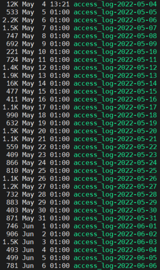

# Crontab과 Logrotate를 활용한 로그 순환
서버 운영에서 로그는  
정말 중요한 데이터 중 하나이다.

이렇게 중요한 데이터이지만,  
덮어두고 쌓다보면 하나의 로그 파일에만  
몇GB가 넘는 용량이 쌓여 스토리지 용량을 잡아먹곤 한다.

 
이를 해결하기 위한 방안으로 Logrotate를 사용하게 되는데,  
이 작업을 동일한 시간대에 실행하기 위해 crontab을 함께 사용하는 방안을 주로 사용한다.

(주로 Daily로 로그가 순환되게끔 사용)

 
## Crontab을 접목한 Logrotate가 실행되는 순서

crontab > cron.daily > logrotate > logrotate.conf > logrotate.d


# Crontab
사용자가 지정한 command를 crons 데몬이 주기적인 작업 실행을 처리

 
## crontab과 관련된 파일

 - /etc/cron.d : 필요한 작업을 등록하는 파일
 - /etc/cron.allow : 해당 파일에 지정된 사용자만 crontab 사용 가능 (지정되지 않으면 사용 불가)
 - /etc/cron.deny : 해당 파일에 지정된 사용자는 crontab 사용 불가능, (허용 파일이 없는 경우)

 

## crontab과 관련된 명령어
```
$crontab -l : 예약된 작업리스트
$crontab -e : crontab 작업 수정
$crontab -r : 예약된 작업 삭제
$crontab -u [username] : root 관리자는 해당 사용자 crontab 파일을 보거나 편집 및 삭제 가능
```


## crontab 예시
`/usr/sbin/logrotate -f /etc/logrotate.d/access_log`

위는 매일 새벽 1시에 apache access_log를 순환시키는 명령어이다.


# Logrotate
직역하면 '로그순환', 말 그대로 로그를 순환시킬 수 있는 기능

 
## Logrotate와 관련된 파일
 - /usr/sbin/logrotate : Logrotate 데몬 프로그램 위치
 - /etc/logrotate.conf : 데몬 설정 파일
 - /etc/logrotate.d/ : 프로세스 설정 폴더 (폴더 내 파일 위치)
 - /etc/cron.daily/logrotate : 작업내역 로그
 
 
## Logrotate와 실행하는 방법

`$/usr/sbin/logrotate -f /etc/logrotate.d/[파일 이름]`



위 내용을 바탕으로 crontab을 적용시키면,  
매일 새로운 파일에 로그가 쌓이게 됩니다.

 
 
# 참조
[btcd tistory](https://btcd.tistory.com/292)
