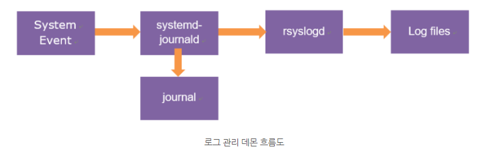
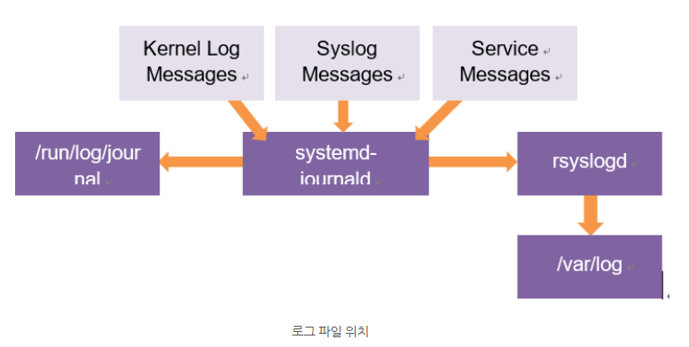

# 로그 기록의 역할
* 문제의 원인 파악
* 인가되지 않은 접근으로 부터 침입 경로 조회

# 리눅스 로그 종류
　|syslog | journal
---|--- | ---
저장하는 것 | syslog에 해당하는 몇 종류 | 부팅 이후 모든 메시지
저장 여부 | var/log | X
데이터 타입 확인 | 일반 메시지 > cat, more, head, tail | 바이너리 형태 > journalctl
서비스 | rsylogd | system-journald
순환 | logrotate | 부팅시(따로 저장이 안 됨)

# 로그 관리 데몬
1. systemd 시스템에서 로그는 rsylogd와 system-journald 두 데몬에 의해 관리
2. system-journald: 부팅부터 모든 로그 수집
3. rsylogd: syslog를 전달하여 각 파일 별로 로그 저장

**[로그 관리 데몬 흐름도]**

**[로그 파일 위치]**

# 커널 로그 메시지
## rsylogd에 의해서 수집되는 로그 파일의 위치
* /var/log 디렉터리에 로그의 종류별로 각각 테스트 파일로 저장

파일 | 종류
---|---
/var/log/messages | 대부분의 로그 기록
/var/log/escure | 인증 관련된 로그
/var/log/maillog | 메일 관련된 로그 기록
/var/log/cron | 주기적인 작업과 관련된 로그 기록
/var/log/boot.log | 부팅 과정에 발생된 로그를 기록

## systemd-journald에 의해서 처리되는 저널(journal)  데이터 파일의 위치
- run/log/journal 디렉터리에 바이너리 파일 형태로 저장
- 확인: journalctl 명령어
- /run 디렉터리는 메모리 기반 파일 시스템인 tmpfs로 마운트 되어 재부팅 되면 저널 데이터 파일 전부 삭제

# rsylogd
* 로그를 기록하기 위한 표준 프로토콜인 syslog 저장하는 프로세스(전송시 암호화 옵션, 로그 처리와 저장 성능 우수)
* /etc/rsylog.conf 파일을 사용하여 저장할 로그의 종류 및 우선순위 설정 가능
* 수신한 로그를 /var/log 디렉터리의 각 파일로 저장

## /etc/rsyslog.conf
* rsylogd에 의해서 전달되는 로그의 규칙들이 정의
* 규칙
  * type.level PATH (필터 - 종류.우선순위, 행동-파일저장 경로)

### etc/rsyslog.conf 필터
* 로그 메시지를 분류하기 위한 기준

#### 필터 형식 3가지
* 1. 기능 및 우선순위 기반 필터: 로그 종류와 로그 우선순위 기준
* 2. 속성 기반 필터: 호스트 이름, 메시지, 태그의 속성을 기준
* 3. 표현 기반 필터: 스크립트를 작성하여 필터링
* 4. 기능

기능 | 설명
---|---
Kern | 커널 메시지
User | 유저 레벨 메시지
Mail | 메일 관련 메시지
Daemon | 시스템 데몬 메시지
Auth | 보안 및 인가 메시지
Syslog | Syslod에 의해 내부적으로 생성된 메시지
Lpr | 라인프린터 하위 시스템
News | 네트워크 뉴스 하위 시스템
Uucp | UUCP 하위 시스템
Cron | 스케줄 작업 메시지
Authpriv | 보안 및 인가 메시지
ftp | ftp 데몬 메시지
Local0-local7 | 사용자 정의 기능

* 5. 우선순위 종류
  * 0에 가까울수록 시스템에 영향이 높은 로그 메시지

코드 | 우선순위 | 설명
---|---|---
0 | emerg | 시스템 사용 불가
1 | alert | 즉시 조치를 취해야 할 상태
2 | crit | 치명적인 상태
3 | err, error | 에러 발생
4 | warn, warning | 경고 발생
5 | Notice | 일반적이지만 중요
6 | info | 간단한 정보
7 | debug | 디버깅 메시지

### 행동(Action)
1. 로그 파일에 저장
  * /etc/rsyslog.conf에서 앞에 \- 기호가 추가로 있는 경우 로그 메시지를 바로 동기화 하지 않고 메모리 버퍼에 저장 후 디스크 자원에 여유가 있을 때 한꺼번에 저장한다.
2. 사용자에게 전달
  * omusmsrg: * -> 모든 사용자에게 메시지 전송
3. 기타 로그 메시지 전달 방식
  * rsylog 행동 유형

종류 | 설명
---|---
콘솔 및 터미널 | 사용자가 로그인한 콘솔이나 원격으로 연결된 사용자의 터미널을 지정하여 로그 메시지 전송(dev/console, dev/tty*)
원격 시스템 | 로그 메시지를 수신할 수 있는 원격 시스템으로 로그 전달
Discard | 로그 메시지를 전달하지 않고 폐기 \~ 기호 사용

# sysemd-journald
* 부팅부터 모든 이벤트가 binary 형태의 journal로 저장이 된다.
* journalctl 명령어를 사용해서 저널 데이터 조회가 된다
* /runlog/journal에 위치하므로 재부팅되면 저널 데이터가 삭제되므로, 데이터를 영구적으로 저장하기 위해서는 별도의 설정이 필요하다.

## journalctl boot-id
1. 시스템을 재부팅하게 되면, 새로운 부트 번호(boot-id)가 생성
2. journalctl -list--boots 명령을 통해 시스템 재부팅으로 인해 분리된 저널 데이터를 각각 조회할 수 있다.
3. journalctl -b BOOT_ID: 특정 BOOT_ID에 해당하는 저널 데이터 
