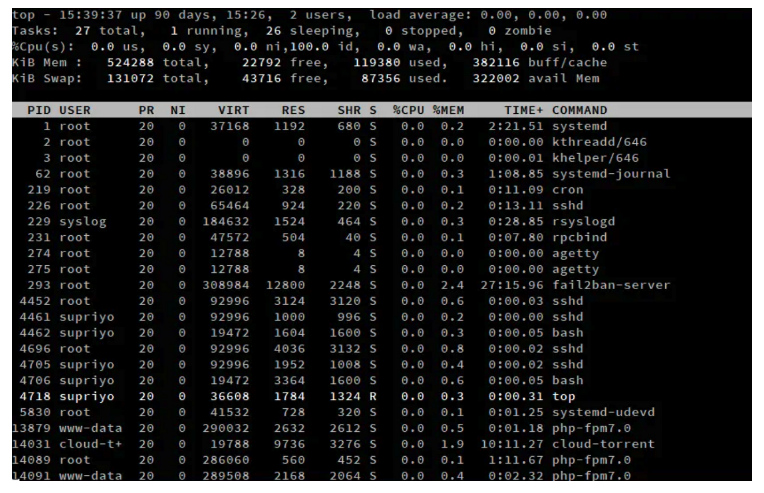

# Load Average란?
리눅스 시스템에서 Load Average는 CPU와 디스크 I/O가  
얼마나 바쁜지 나타내는 지표 중 하나다.  
쉽게 말해, 시스템에 대한 부하정도를 나타내는 지표다.

Load Average는 1분, 5분, 15분의 평균값으로 표현되며, 이 지표를 통해 시스템이 얼마나 바쁜지를 알 수 있다.

리눅스 시스템에서는 Load Average를 통해 시스템 부하를 파악하고,  
시스템 리소스를 효율적으로 관리할 수 있다.


## Load Average의 의미
Load Average가 1이라면, 시스템이 CPU 코어 1개를 100% 사용하고 있다는 의미다.  
만약 Load Average가 4라면, 시스템이 CPU 코어 4개를 100% 사용하고 있거나,  
CPU 코어 1개를 400% 사용하고 있다는 의미다.

Load Average가 높다는 것은 시스템이 바쁘게 일하고 있다는 것을 의미한다.  
따라서, Load Average가 일정 시간 동안 계속해서 높게 유지된다면,  
시스템 성능을 향상시키기 위해 적절한 대응이 필요하다.

## 해결책
Load Average가 일정 시간 동안 계속해서 높게 유지된다면,  
시스템에 대한 추가 리소스 할당 또는 프로세스의 성능 향상을 고려해야 한다.

부하가 높은 프로세스를 찾아내고, 해당 프로세스를 중지하거나 종료하여 대응하거나,  
CPU나 메모리 등의 하드웨어 리소스를 추가하는 등의 대응 방법을 고려할 수 있다.

## Load Average 값 확인하기
### uptime command 
리눅스에서는 uptime 명령어를 사용하여 시스템의 Load Average 값을 확인할 수 있다.  
uptime 명령어를 실행하면, 현재 시간, 시스템 작동 시간, 로그인한 사용자 수,  
Load Average 값 등의 정보를 확인할 수 있다.

```
$ uptime
10:23:10 up 3 days, 12:06,  1 user,  load average: 1.41, 1.37, 1.35
```

위 예시에서, Load Average 값은 1.41, 1.37, 1.35 입니다.

첫번째 값 : 1분 동안의 평균값  
두번째 값 : 5분 동안의 평균값  
세번째 값 : 15분 동안의 평균값

### top command
또한, top 명령어를 사용하여 프로세스별 CPU 사용량 및 메모리 사용량 등의 정보를 확인할 수 있다.  
top 명령어를 실행하면, CPU 사용량이 높은 프로세스를 찾아낼 수 있다.

`$ top`
 
명령어를 입력하면 상단에 load average가 나온다.

마찬가지로 첫번째 값은 1분 동안의 평균값이고  
두번째 값은 5분 동안의 평균값 그리고 세번째 값은 15분 동안의 평균값을 의미한다.




### CPU core 수 확인하기 
참고로 리눅스에서는 lscpu 명령어를 사용하여 시스템의 CPU 정보를 확인할 수 있다.  
이 명령어를 실행하면, 시스템의 CPU 정보, 코어 수, 소켓 수,  
하이퍼스레딩 지원 여부 등의 정보를 확인할 수 있다.

`$ lscpu`

위 명령어를 실행하면 다음과 같은 정보가 출력된다.

```
lessCopy code
Architecture:                    x86_64
CPU op-mode(s):                  32-bit, 64-bit
Byte Order:                      Little Endian
CPU(s):                          4
On-line CPU(s) list:             0-3
Thread(s) per core:              2
Core(s) per socket:              2
Socket(s):                       1
NUMA node(s):                    1
Vendor ID:                       GenuineIntel
CPU family:                      6
Model:                           142
Model name:                      Intel(R) Core(TM) i5-8250U CPU @ 1.60GHz
Stepping:                        10
CPU MHz:                         1800.000
CPU max MHz:                     3400.0000
CPU min MHz:                     400.0000
BogoMIPS:                        3984.00
Virtualization:                  VT-x
L1d cache:                       64 KiB
L1i cache:                       64 KiB
L2 cache:                        512 KiB
L3 cache:                        6 MiB
NUMA node0 CPU(s):               0-3
```

위 결과에서 CPU(s) 항목은 시스템에 있는 총 CPU 코어 수를 나타내며,  
이 경우에는 4개의 코어가 있음을 확인할 수 있다. 


# 참고 자료
[1minute-before6pm tistory](https://1minute-before6pm.tistory.com/61)
