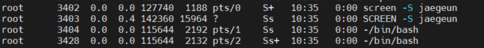

# [screen 사용법](https://bio-info.tistory.com/42)
* Screen이란 Linux에서 독립적으로 동작하는 가상 터미널을 띄워주는 것을 의미한다.  
* 백그라운드로 동작하는 가상 터미널이다.

## screen 장점
스크린에서 명령어를 실행시키고 터미널을 꺼도, 명령어가 백그라운드로 계속 돌아간다.  
명령어를 실행시킨 뒤 터미널을 종료하고,  
나중에 screen 명령을 이용해서 다시 접속하면 해당 터미널 그대로 작업을 이어갈 수 있다.




## screen 설치
1) Centos 등 (Redhat 계열)  
yum install screen

2) Ubuntu 등 (Debian 계열)  
apt-get install screen

## screen 환경설정하기

`vi ~/.screenrc`

```shell
# GNU Screen - main configuration file 
# All other .screenrc files will source this file to inherit settings.
# Author: Christian Wills - cwills.sys@gmail.com

# Allow bold colors - necessary for some reason
attrcolor b ".I"

# Tell screen how to set colors. AB = background, AF=foreground
termcapinfo xterm 'Co#256:AB=\E[48;5;%dm:AF=\E[38;5;%dm'

# Enables use of shift-PgUp and shift-PgDn
termcapinfo xterm|xterms|xs|rxvt ti@:te@

# Erase background with current bg color
defbce "on"

# Enable 256 color term
term xterm-256color

# Cache 30000 lines for scroll back
defscrollback 30000

# New mail notification
#backtick 101 30 15 $HOME/bin/mailstatus.sh

hardstatus alwayslastline 
# Very nice tabbed colored hardstatus line
hardstatus string '%{= Kd} %{= Kd}%-w%{= Kr}[%{= KW}%n %t%{= Kr}]%{= Kd}%+w %-= %{KG} %H%{KW}|%{KY}%101`%{KW}|%D %M %d %Y%{= Kc} %C%A%{-}'

# change command character from ctrl-a to ctrl-b (emacs users may want this)
#escape ^Bb

# Hide hardstatus: ctrl-a f 
bind f eval "hardstatus ignore"
# Show hardstatus: ctrl-a F
bind F eval "hardstatus alwayslastline"

# Below's for MAC only
# shell:  Default process started in screen's windows.
# Makes it possible to use a different shell inside screen
# than is set as the default login shell.
# If begins with a '-' character, the shell will be started as a login shell.
shell -$SHELL
```


# Commands
Commands | 설명
---|---
screen -S 세션명 | 세션 생성
Ctrl+a A | 현재 screen의 이름을 정한다. 
Ctrl+a c | screen에서 새창 띄우기
Ctrl+a k | 현재 screen 죽이기.
Ctrl+a a | 바로 전 창으로
Ctrl+a n | 다음 창으로 
Ctrl+a p | 이전 창으로 
Ctrl+a " | 열린 screen list 을 보여줌.
Ctrl+a 0 | 0번째 창으로Ctrl+a 1 : 1번째 창으로Ctrl+a 9 : 10번째 창으로
Ctrl+a d | screen 때어내기 (현재 상태로 남겨두는거..)
Ctrl+a x | 이전에 남겨둔 screen에 다시 붙이기.
screen -r 세션명 | 강제로 종료된거에 다시 붙이기
ps -eaf | grep screen | 여러개 열려있을 경우 찾아서 죽여주기
screen -list | 현재 열려있는 리스트를 보여줌.
Ctrl+a ?  | 도움말
Ctrl+a k  | 스크린 닫기
Ctrl+a ESC, Ctrl+a [   | 화면 스크롤
Ctrl+a ] | 붙여넣기.
Ctrl+a S  | 화면 수평 분할
Ctrl+a \| | 화면 수직 분할
Ctrl+a: reisze | resize
Ctrl+a: fit | fit screen size to new terminal size
Ctrl+a: remove | remove region
Ctrl+a Q | 현재 region을 제외한 나머지 숨기기
Ctrl+a tab | 화면 분할 이동
Ctrl+a \: | 명령행 모드로 전환
Ctrl+ X | 현재 화면 닫기
