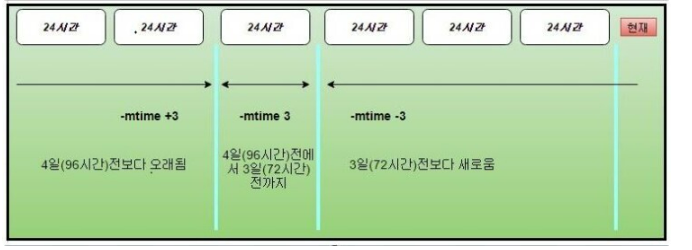
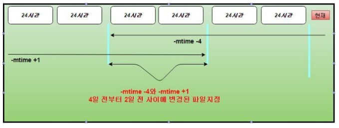
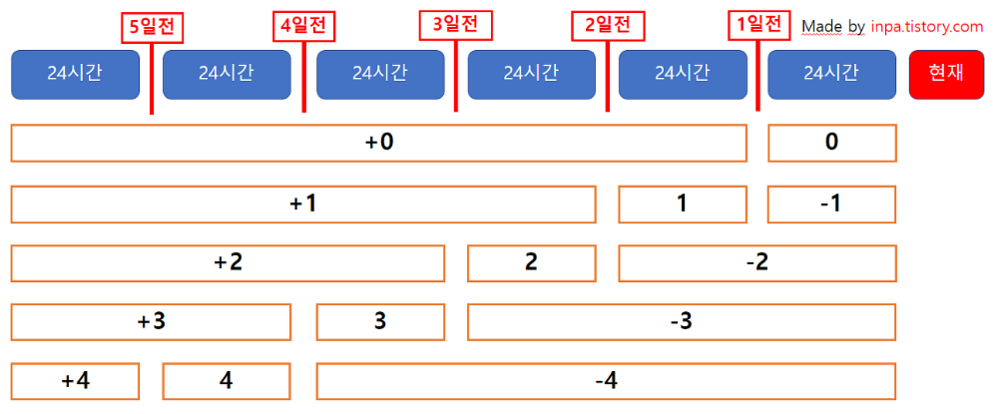

# 리눅스 타임스탬프 
리눅스에서 파일의 시간 정보(Timestamps)를 기록하는데 inodeVisit Website 라는 곳에 저장이 된다.

inode에 저장되는 시간정보는 ctime, mtime, atime이 존재한다.

```SHELL
$ stat [파일명]
```

 

# atime (access time, 접근 시간)
atime은 파일에 접근한 시간을 나타낸다.

파일을 open 할 때마다 갱신이 되며 vi, cat 명령으로 파일 확인시 atime의 값이 변한다.

```SHELL
$ ls -lu
```

 

# mtime (modification time, 수정 시간)
파일의 내용이 수정될 때 mtime 시간이 변한다.

```SHELL
$ ls -l
```
 

# ctime (change time, 변경 시간)
inode의 값 (파일 속성, 권한, 크기 등)이 변경되면 ctime이 갱신된다.

```SHELL
$ ls -lc
```

# find 타임스탬프 옵션
몇일이 지난 로그 파일들을 찾아 자동 삭제할때 가장 많이 쓰이는 옵션이 바로 타임스탬프 옵션이다.

다만, 개념이 굉장히 난해하고 사용하기 까다로워 제대로 정리해보는 시간을 가져보자.

 

## 타임스탬프 옵션
분 단위로 시간도 추가로 find 명령어에서 사용할 수 있다.

옵션	| 요약
---|---
-mmin	| 파일의 데이터가 마지막으로 수정 된 시간 (분 지정)
-mtime	| 파일의 데이터가 마지막으로 수정 된 날짜와 시간 (일 지정)
-amin	| 파일의 데이터에 마지막으로 액세스 한 날짜와 시간 (분 지정)
-atime	| 파일의 데이터에 마지막으로 액세스 한 날짜와 시간 (일 지정)
-cmin	| 파일 데이터 및 상태가 마지막으로 수정 된 시간 (분 지정)
-ctime	| 파일 데이터 및 상태가 마지막으로 수정 된 날짜와 시간 (일 지정)


# find -mtime n 개념 익히기
특정 기간에 작성, 변경된 파일 목록을 조회하고 싶을 때 find 명령어에서  
-mtime옵션은 파일명에 있는 날짜가 아니라 파일의 타임스탬프로 파일을 검색한다.

 
기본 사용법은 find -mtime n (일수)를 지정하는데 (n일 전 = n x 24시간전)

 
이 n(일수) 계산법 과 표현법이 조금 까다롭다.

일단 일수 표현을 대충 정리하자면 다음과 같다.

```BASH
# 만일 현재시간이 10월 10일 이라고 가정한다면,
 
$ find -mtime -3 # 3일(72시간)전 ~ 현재시간 -> 10.7 ~ 10.10
 
$ find -mtime 3  # 4일(96시간) 전 ~ 3일(72시간)전까지 -> 10.6 ~ 10.7
 
$ find -mtime +3 # 4일(96시간)전보다 과거 -> ~ 10.6
```


명령어에서 볼수 있듯이 n이 3 이라고 해서 바로 3일전이 아니라  
24시간이 추가 범위적으로 계산됨을 볼 수 있다. 

 

이는 리눅스에서 시간을 지정해서 검색할 때는  
고정된 날짜와 시간 값으로 사용할 수 없기 때문이다.

명령어를 수행하는 지금의 시간을 기준으로  
타임스탬프의 24시간 단위로만 검색을 할 수 있다.

 

예를 들어,

"2021년 1월 1일 파일을 찾아라!" 는 불가능하고,

"지금 시간을 기준으로 24시간 전에 파일을 찾아라" 로 명령을 이행해야 된다.

```BASH
# 4일 전부터 2일 전까지 갱신된 파일 목록을 표시
$ find . -name "*.log" -mtime -4 -mtime +1 -print
```




# 시간 범위 n 정리
예제 코드를 봐도 햇깔린다. 도표로 보기 쉽게 정리해보았다.

4일전 ~ 2일전 범위를 자세히 살펴보니 -4와 +1 을 명시해주면 범위가 생김을 볼 수 있다.



 

## ⊙ 시간단위 (mtime , ctime , atime)
지정된 n숫자 x 24 를 기준시간으로 정하고,

기준시간에서 24시간 과거 시간까지를 시간범위로 지정한다.

* 부호가 없으면 시간 범위가 검색시간
  * 0 : -24h ~ 현재
  * 1 : -48h ~ -24h
  * 2 : -72h ~ -48h
* + 면 시간범위보다 과거 시간이 대상 범위가 검색시간
  * +0 : 과거 ~ -24h
  * +1 : 과거 ~ -48h
  * +2 : 과거 ~ -72h
* - 면 기준시간부터 현재까지 대상 범위가 검색시간
  * -0 : 없음
  * -1 : -24h ~ 현재
* -2 : ~48h ~ 현재
 

## ⊙ 분단위 (mmin, cmin, amin)
지정된 숫자를 기준 분으로 정하고

* 부호가 없으면 분 범위가 검색시간
  * 1 : 1m 전에 변경된 파일 검색
  * 2 : 2m 전에 변경된 파일 검색
* + 면 기준분의 과거 시간이 대상 범위가 검색시간
  * +1 : 과거 ~ -1m 
  * +2 : 과거 ~ -2m
* - 면 기준분부터 현재까지가 대상 범위가 검색시간
  * -1 : -1m ~ 현재
  * -2 : -2m ~ 현재


## find -mtime n 예제
find -mtime n (일수)에서 'n일 = n*24시간' 이다 달력상의 일수가 아니다.

* find -mtime -2  :  2일(48시간) 이내에 수정된 파일 (기준에서 현재까지가 검색 대상)
* find -mtime 2   :  3일(72시간) ~ 2일(48시간) 사이에 수정된 파일 (숫자 앞에 +, - 부호가 없으면 시간 범위가 검색 대상)
* find -mtime +2 :  3일(72시간) 보다 과거인 보다 이후에 수정된 파일 (기준에서 과거 시간 전체가 검색 대상)

> Tip  
> -mtime옵션은 -,+ 부호에 따라서 그 의미가 달라지므로 확실히 숙지해서 사용하자. 

```BASH
# 현재 날짜 확인. 
$ date
2015년 10월 23일 2시 36분.
```

```BASH
$ find -name "*.log" -mtime -2 -exec ls -lrt {} \;   
 
# -mtime옵션 -2 : 2일(48시간) ~ 현재
# 현재 날짜가 10월 23일 2시 36분 이므로, 10월 21일 2시 36분 ~ 현재시간 사이의 파일 조회.
```

```BASH
$ find -name "*.log" -mtime 2 -exec ls -lrt {} \;   
 
# -mtime옵션 2 : 3일(72시간) ~ 2일(48시간)
# 현재 날짜가 10월 23일 2시 36분 이므로, 10월 20일 2시 36분 ~ 10월 21일 2시 36분 사이의 파일 조회.
```

```BASH
$ find -name "*.log" -mtime +2 -exec ls -lrt {} \;   
 
# -mtime옵션 +2 : 과거 ~ 3일(72시간)
# 현재 날짜가 10월 23일 2시 36분 이므로, 10월 20일 2시 36분 이전의 파일 조회.
```

```BASH
$ find -name "*.log" -mtime +1 -mtime -4 -exec ls -lrt {} \;   
 
# -mtime옵션 +1 : 2일(48시간) 이전에 작성, 변경된 파일 조회
# -mtime옵션 -4 : 4일(96시간) 이내에 작성, 변경된 파일 조회   
 
# 현재 날짜가 10월 23일 2시 36분 이므로 
# -4(10월19일 2시 36분) ~ +1(10월 21일 2시 36분) 사이의 파일 조회.
```

```BASH
$ find /home/service/*.* -mtime +7 -exec rm -f {} \;
 
# 수정된지 8일 이상된 모든 형식의 파일들 삭제
```

## find -mmin n 예제
주기적으로 파일이 생성 되어야 하는 곳에서 파일의 존재 여부 확인 할때 사용하면 좋다.
$ find -mmin -1 이런 식으로 1분 안에 갱신된 파일이 있는지 존재 여부를 확인

```BASH
# 현재 날짜 확인. 
$ date
2021년 1월 10일 17시 40분
```

```BASH
$ find -name "*.log" -mmin 7 -exec ls -lrt {} \;   
 
# 7분전이 대상. 
# 2021년 1월 10일 17시 33분 파일들이 조회 (7분전에 변경된 파일이 있는 지 검색)
```

```BASH
$ find -name "*.log" -mmin +7 -exec ls -lrt {} \;   
 
# 7분전 보다 과거가 대상
# 과거 시간 ~ 2021년 1월 10일 17시 32분 파일들이 조회 (수정된지 7분이 넘은 파일)
```

```BASH
$ find -name "*.log" -mmin -7 -exec ls -lrt {} \; 
 
# 7분전에서 현재까지 대상
# 2021년 1월 10일 17시 34분 ~ 2021년 1월 10일 17시 40분 파일들이 조회 (수정 된지 7분이 된 파일)
```

# daystart 옵션
daystart 옵션을 지정하면 하루의 기준을 0시로 설정 한다.

달력 일수 단위로 범위 지정 하려는 경우에 이 옵션을 사용하면 된다.

 

예를 들어, 현재 12 월 24 일 03시 00분을 기준으로 보면 다음과 같다.

```BASH
# 3 일전 ~ 현재 (12 월 24 일 24시 00 분 ~ 72 시간 전)
$ find ./ -daystart -mtime -3
 
# 3 일 전 (12 월 21 일 24시 00 분 ~ 24 시간 전)
$ find ./ -daystart -mtime 3
 
# 3 일전 ~ 과거 (12 월 21 일 24시 00 분 ~ 과거)
$ find ./ -daystart -mtime +3
```
 

소수점 아래로 지정도 가능하다.

```BASH
# 하루의 반(12 시간) 전까지 (현재 시간 ~ 12 시간 전)
$ find ./ -mtime -0.5
```


# 참고 자료
[inpa tistory](https://inpa.tistory.com/entry/LINUX-%F0%9F%93%9A-find-%EB%AA%85%EB%A0%B9-mtime-ctime-atime-%EC%98%B5%EC%85%98-n-n-%EA%B0%9C%EB%85%90-%EC%A0%95%EB%A6%AC)
