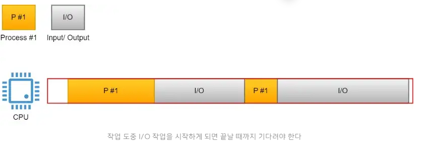
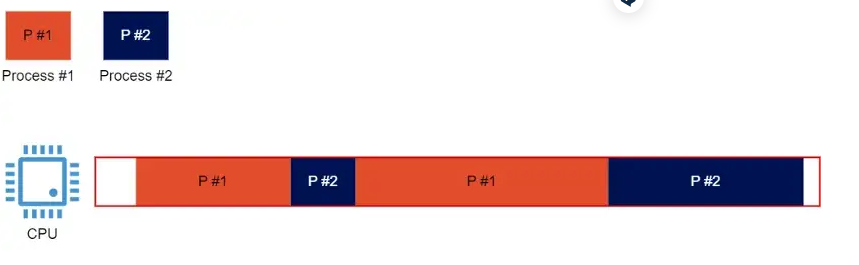
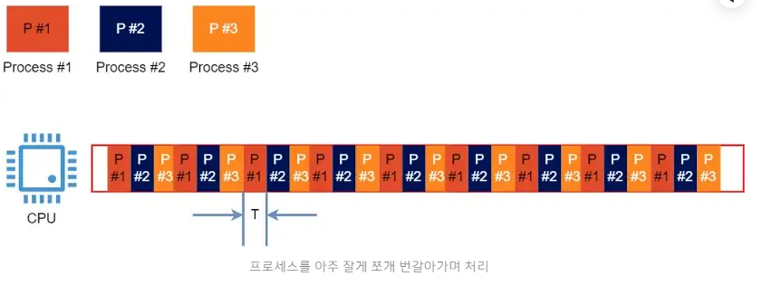
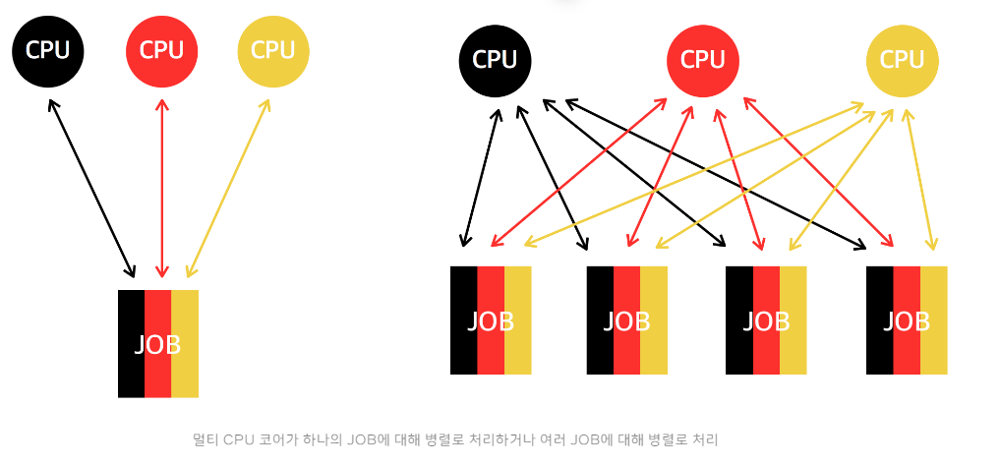
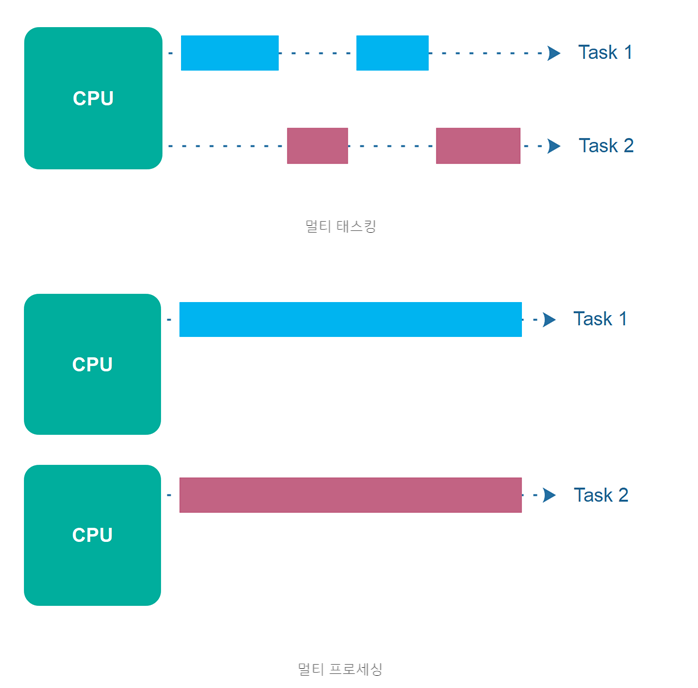
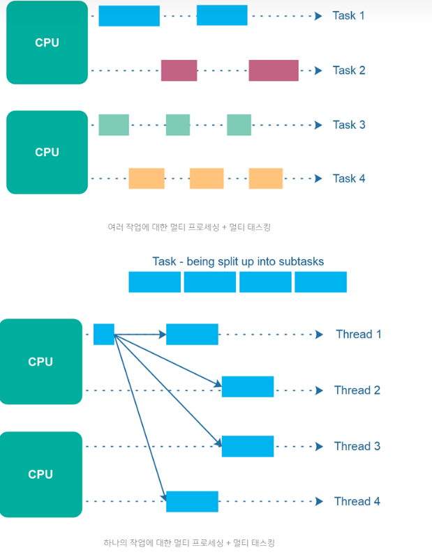
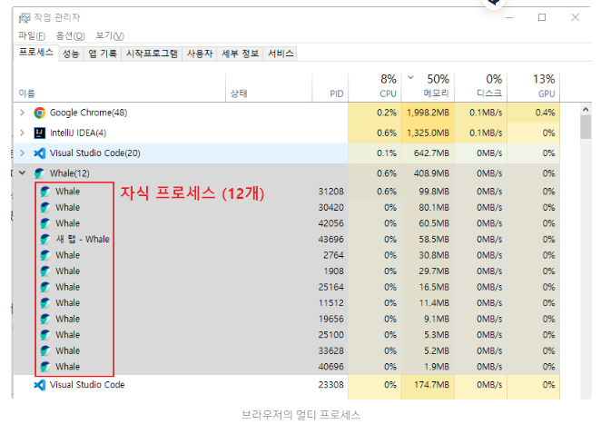

# 컴퓨터의 병행 처리
우리가 음악을 들으면서, 웹서핑을 하고, 메신저의 메시지를 확인할 수 있는 이유는  
컴퓨터가 자원을 효율적으로 사용하는 멀티 태스킹(Multi Tasking) 기술 덕분이다.  
멀티 태스킹이란 컴퓨터에서 여러 작업을 동시에 실행하는 능력을 말한다.  
좀더 자세히 말하자면, OS를 통해 CPU가 작업하는데 필요한 자원을 프로세스 또는 스레드간에 나누는 행위를 말한다.  
두 가지 이상 작업을 동시에 처리할 수 있는 이유가 이러한 자원 분담 원리 때문이다.

지금 부터 제한된 자원을 가지고 수십가지의 프로그램을 동시에 실행할 수 있는 원리를 파헤쳐 보자.

# 프로세싱의 발전 과정
## 단일 프로세스 (Single Process)
초창기 컴퓨터는 단일 프로세스 시스템 이었다.  
한번에 하나의 프로그램만이 실행할 수 있어서, 또 다른 프로그램을 실행하고 싶다면 현재 프로그램을 종료해야 했다.  
거기다 CPU 사용률이 효율적이지 못했는데, 프로그램 실행 도중 I/O(입출력) 작업과 같은 일이 생기게 되면  
CPU는 프로세스를 멈추고 그대로 놀아버리기 때문이다.

> Info   
> IO(input/output) 이란?    
> 흔히 프로그래밍에서 IO 라고 하면 대표적으로 3가지 뜻을 내포하고 있다.  
> - 파일을 읽고 쓰는 것  
> - 서버 네트워크의 어딘가와 데이터를 주고 받는 것  
> - 마우스, 키보드와 같은 입출력 장치와 데이터를 주거나 받는 것

## 멀티 프로그래밍 (Multi Programming)
이러한 문제를 해결하기 위해 여러개의 프로그램을 메모리에 올려놓고  
하나의 CPU에서 번갈아 가며 동시에 실행시키는 방안을 첨가 하였다.

멀티 프로그래밍은 여러개의 프로그램이 동시에 실행된다는 의미로서, CPU 사용률을 극대화 시키는게 목적을 두었다.  
단일 프로세스의 문제점이었던 프로세스 #1 작업 시작 후 I/O 작업을 만나게 되면 CPU가 노는게 아니라  
프로세스 #2 작업을 시작하게 된다.  
다시 프로세스2 작업 시작 후 I/O 작업을 만나게 되면 프로세스1 작업을 시작하게 된다. 

그러나 어느 한 프로그램이 CPU 사용 시간이 길어지면 다른 프로세스는 계속 대기를 해야 한다는 문제점이 존재 하였다.  
위의 그림에서 P #1 작업 시간이 엄청 길어질 경우 P #2 는 실행될 기회조차 못 얻게 된다.

# 멀티 태스킹 (Multi Tasking)
멀티 프로그래밍의 취지는 좋았지만 어느한 프로세스가 모두 실행되야 다음 프로세스가 실행될 수 있는 한계점이 있었다.  
따라서 이것을 해결하기 위해 프로세스는 한번 CPU를 사용할때 아주 짧은 시간(quantum)만 실행되도록 하여  
각 프로그램의 작업을 아주 작은 단위로 번갈아 가며 처리하면서,  
작업 응답 시간을 최소화 시키는 멀티 태스킹 원리가 탄생하였다. 

이때 잘게 나뉘어진 프로세스 끼리 작업이 스위칭 되는 것을 문맥 교환(Context Switching) 이라고 한다.

이렇게 프로세스 작업이 잘게 나뉘어져 교대로 실행함으로써 얻게 되면 이점은 다음과 같다.

 

## 1. 빠른 반응성 제공
첫째, CPU가 잘게 나눈 각 작업들을 빠르게 번갈아 가며 수행함으로서, 여러 작업을 동시에 처리하는 것처럼 보이게 만들어,  
사용자에게 더 빠른 반응성을 제공하여 정말로 동시에 프로그램이 실행되는 것처럼 느껴 차이를 못느끼게 된다.

 

## 2. 문제 해결 용이성
둘째, 작업을 나누었기 때문에 예기치 않은 문제가 발생했을 때, 해당 작업만 중지할 수 있게 된다.  
이러한 방식으로, 전체 시스템이 멈추는 것을 방지할 수도 있다.

 

## 3. 멀티 프로세서의 효율적인 활용
셋째, 멀티 프로세싱 또는 멀티 코어를 사용하는 시스템에서 여러 개의 프로세서(CPU)가  
동시에 작업을 효율적으로 처리할 수 있다.

 

## 4. 프로세스 우선순위 조절
넷째, 프로세스 간의 우선순위를 조절이 수월해진다. 예를들어 우선순위가 높은 작업은 더 자주 실행되어,  
더 빠른 처리를 할 수도 있는 셈이다.

따라서, 작업을 작게 나누어 처리하는 원리는 빠른 반응성을 제공하는 핵심 부분인 셈이다.  
그러나 응답성을 향상하기 위해서 문맥 교환(Context Switching)이 자주 일어나게 될 경우 오히려 성능 이슈가 발생할 수 있다는 문제점이 있다.  
왜냐하면 프로세스 끼리 스위칭 하는 작업은 우리가 생각하는 것 보다 꽤나 무거운 작업에 해당하기 때문이다.

# 멀티 프로세싱 (Multi Processing)
옛날 컴퓨터의 CPU는 싱글 코어(core) 였다. 이 싱글 코어에서 여러개의 작업을 동시에 처리하기 위해  
멀티 태스킹과 같은 기술을 차용해 작업을 처리한 것이다. 그러나 시대가 발전함에 동시에 CPU 코어의 발열 한계로 인해  
코어 깡 클럭을 높이지 않고 코어를 늘리는 방향으로 듀얼 코어, 쿼드 코어 CPU 제품을 출시하기 시작했다. 

컴퓨터를 맞출때 한번 쯤은 '4코어 8스레드'와 같은 CPU 스펙에 대해 들어본적이 있을텐데 바로 이것을 말하는 것이다. 

즉, 한 CPU에 두개 이상의 코어를 둬서 전체적인 성능을 향상시키는 방향으로 전환을 한 것이다.  
그리고 여러 개의 CPU 코어가 동시에 작업을 처리하는 것을 멀티 프로세싱 (Multi Processing) 이라 한다.  
이러한 멀티 프로세싱을 아키텍쳐 구조에 따라 종류도 여러가지 이다.

# 멀티 프로세싱 vs 멀티 태스킹
멀티 프로세싱 (Multi Processing)이란, 여러 개의 CPU 코어가 동시에 작업을 처리하는 것을 의미한다.  
여러 개의 프로세서가 병렬로 작업을 수행하므로, 단일 프로세스보다 빠른 처리 속도를 보장할 수 있다.  
멀티 태스킹 (Multi Tasking)은 단일 CPU에서 여러 개의 작업을 동시에 처리하는 것을 의미한다.  
하나의 CPU가 여러 작업들을 번갈아가며 처리하므로, 여러 개의 작업을 동시에 수행하는 것처럼 보이게 된다.   
따라서, 둘은 여러 작업에 대해서 동시에 처리하는 목적은 비슷하지만,  
멀티 태스킹은 하나의 CPU에서 여러 개의 작업을 처리하는 반면,  
멀티 프로세싱은 여러 개의 CPU가 각각의 작업을 처리하는 것이라는 차이점이 있다. 

## 멀티 프로세싱 + 멀티 태스킹 조합
둘은 서로 다른 동시 처리 방법이기 때문에 이 둘을 조합하여 더욱 더 시너지 효과를 누릴 수 있다.

# 멀티 프로세싱 vs 멀티 프로세스
multi processing 과 multi process 는 영어는 그저 동명사(-ing) 차이 이지만,  
이 둘이 의미하는 바는 전혀 다르다. 아마 많은 사람들이 이 둘을 햇깔려 할 것이다.

멀티 프로세싱은 하나의 시스템에서 여러 개의 프로세서(CPU)를 사용하여 작업을 처리하는 것을 의미한다.  
즉, 프로세서(CPU)가 멀티인 것이다. 여러 개의 프로세서가 동시에 작업을 처리하므로,  
전체적인 처리 속도가 빨라지는 효과에 목적을 둔다.
반면, 멀티 프로세스는 하나의 응용 프로그램을 여러 개의 프로세스로 분리하여 실행하는 것을 의미하는 것이다.  
즉, 프로세스(process)가 멀티인 것이다. 여러 개의 프로세스가 동시에 실행되므로,  
하나의 프로세스가 죽어도 프로그램이 죽지않아 프로그램 전체의 안정성이 높아지는 것에 목적을 둔다.  
보통 멀티 프로세스는 부모 프로세스와 그의 여러 자식 프로세스로 이루어져 있다.

# 참고 자료
[inpa tistory](https://inpa.tistory.com/entry/%F0%9F%91%A9%E2%80%8D%F0%9F%92%BB-multi-programming-tasking-processing)
