프로세스 (Process)	| 스레드 (Thread)
---|---
운영체제로부터 자원을 할당받은 작업의 단위	| 프로세스가 할당받은 자원을 이용하는 실행 흐름의 단위

# 프로그램 과 프로세스
## 정적 프로그램 (Static Program)
컴퓨터 전공이 아니라서 '프로세스' 라는 명칭은 낯설수 있는데, '프로그램' 은 친숙하리라 생각된다.

프로그램은 윈도우의 \*.exe 파일이나 Mac의 \*.dmg 파일과 같은 컴퓨터에서 실행 할 수 있는 파일을 통칭한다.  
단, 아직 파일을 실행하지 않은 상태이기 때문에 정적 프로그램(Static Program) 줄여서 프로그램(Program)이라고 부른 것이다.

어떠한 프로그램을 개발하기 위해선 자바나 C언어와 같은 언어를 이용해  
코드를 작성하여 완성된다. 즉, 프로그램은 쉽게 말해서 그냥 코드 덩어리 인 것이다.

## 프로세스 (Process)
프로그램이 그냥 코드 덩어리이면, 프로세스는 프로그램을 실행 시켜  
정적인 프로그램이 동적(動的)으로 변하여 프로그램이 돌아가고 있는 상태를 말한다.  
즉, 컴퓨터에서 작업 중인 프로그램을 의미하는 것이다.

이 개념은 절대 생소한 것이 아니다. ctrl + alt + del 단축키를 눌러 우리가 항상 보던  
'작업' 관리자를 열어보면 개념이 고대로 들어있는걸 볼 수 있을 것이다.

작업 끝내기는 실행중인 프로그램인 프로세스를 끝내는 것이다  
모든 프로그램은 운영체제가 실행되기 위한 메모리 공간을 할당해 줘야 실행될 수 있다.  
그래서 프로그램을 실행하는 순간 파일은 컴퓨터 메모리에 올라가게 되고,  
운영체제로부터 시스템 자원(CPU)을 할당받아 프로그램 코드를 실행시켜  
우리가 서비스를 이용할 수 있게 되는 것이다.

어쨋든 똑같은 어플리케이션을 실행 하냐 안하냐 차이일 뿐이라서,  
일반적으로 프로세스와 프로그램을 같은 개념으로 이야기할 때가 많지만,  
정의를 보았듯이 엄밀히 따지면 이 둘은 다른 개념인 것이다.

최종적으로 이 둘을 간단 명료하게 정리하면 아래 표와 같다.

프로그램	| 프로세스
---|---
어떤 작업을 하기 위해 실행할 수 있는 파일	| 실행되어 작업중인 컴퓨터 프로그램
파일이 저장 장치에 있지만 메모리에는 올라가 있지 않은 정적인 상태	| 메모리에 적재되고 CPU 자원을 할당받아 프로그램이 실행되고 있는 상태
쉽게 말해 그냥 코드 덩어리	| 그 코드 덩어리를 실행한 것

# 스레드
## 프로세스의 한계
과거에는 프로그램을 실행할 때 프로세스 하나만을 사용해서 이용했었다.  
하지만 기술이 발전됨에 따라 프로그램이 복잡해지고 다채로워짐으로써  
프로세스 작업 하나만을 사용해서 프로그램을 실행하기에는 한계가 있었다.

오늘날 컴퓨터는 파일을 다운 받으며 다른 일을 하는 멀티 작업은 너무 당연한 기능이라고 생각할지 모르겠지만,  
과거에는 파일을 다운받으면 실행 시작부터 실행 끝까지 프로세스 하나만을 사용하기 때문에  
다운이 완료될때까지 하루종일 기다려야 했다. 그렇다고 동일한 프로그램을 여러 개의 프로세스로 만들게 되면,  
그만큼 메모리를 차지하고 CPU에서 할당받는 자원이 중복되게 될 것이다.  
스레드(Thread)는 이러한 프로세스 특성의 한계를 해결하기 위해 탄생 하였다.

## 스레드의 개념
스레드란, 하나의 프로세스 내에서 동시에 진행되는 작업 갈래, 흐름의 단위 를 말한다.

이해하기 쉽게 비유를 들자면, 크롬 브라우저가 실행 되면 프로세스 하나가 생성될 것이다.  
그런데 우리는 브라우저에서 파일을 다운 받으며 온라인 쇼핑을 하면서 게임을 하기도 한다.

즉, 하나의 프로세스 안에서 여러가지 작업들 흐름이 동시에 진행되기 때문에 가능한 것인데,  
이러한 일련의 작업 흐름들을 스레드라고 하며 여러개가 있다면 이를 멀티(다중) 스레드 라고 부른다.

아래 그림에서 보듯이 하나의 프로세스 안에 여러개의 스레드들이 들어 있다고 보면 된다.  
스레드 수가 많을 수록 당연히 프로그램 속도도 동시에 하는 작업이 많아져 성능이 올라간다.

일반적으로 하나의 프로그램은 하나 이상의 프로세스를 가지고 있고,  
하나의 프로세스는 반드시 하나 이상의 스레드를 갖는다.  
즉, 프로세스를 생성하면 기본적으로 하나의 main 스레드가 생성되게 된다.  
스레드 2개, 3개.. 는 프로그램을 개발한 개발자가 직접 프로그래밍하여 위치 시켜주어야 한다.  
그래서 별도로 스레드 프로그래밍 과목이 있는 이유이기도 하다. 

지금까지 프로그램, 프로세스, 스레드에 관한 아주 기본적인 개념 흐름과 차이에 대해 알아보았다.  
그러나 이정도의 운영체제 지식만으로는 "프로세스와 스레드의 차이에 대해  
말하라는" 기술 면접에서 통과하기는 힘들 것이다.

왜냐하면 단순 프로세스와 스레드의 차이점 뿐만 아니라 프로세스와 스레드의 내부 작동 방식을 이해하고 있는지  
궁금해하는 면접관이 대부분이기 때문이다. 사실 위에서 한 설명은 뉴비라도 최대한 이해하기 쉽게 풀어쓴 내용이라  
저 부분만으로는 프로세스와 스레드를 이해하는데 있어 많이 부족하다.  
운영체제가 시스템 자원을 어떤 방식으로 할당하고 프로그램은 자원을 어떤 방식으로 활용하는  
내부 작동 방식을 이해하고 있어야, 기술 면접도 그렇고 나중에 스레드 프로그래밍 할때  
응용이 가능하기 때문에 이 포스팅을 끝까지 읽는 것을 권장하는 바다.

# 프로세스 & 스레드의 메모리

## 프로세스의 자원 구조
프로그램이 실행되어 프로세스가 만들어지면  
다음 4가지의 메모리 영역으로 구성되어 할당 받게 된다.

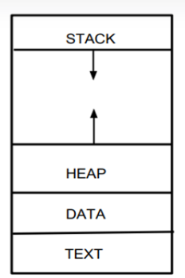

* 코드 영역(Code / Text) : 프로그래머가 작성한 프로그램 함수들의 코드가 CPU가 해석 가능한 기계어 형태로 저장되어 있다.
* 데이터 영역(Data) : 코드가 실행되면서 사용하는 전역 변수나 각종 데이터들이 모여있다. 데이터영역은 .data ,.rodata, .bss 영역으로 세분화 된다.
  * data : 전역 변수 또는 static 변수 등 프로그램이 사용하는 데이터를 저장
  * BSS : 초기값 없는 전역 변수, static 변수가 저장
  * rodata : const같은 상수 키워드 선언 된 변수나 문자열 상수가 저장
* 스택 영역(Stack) : 지역 변수와 같은 호출한 함수가 종료되면 되돌아올 임시적인 자료를 저장하는 독립적인 공간이다. Stack은 함수의 호출과 함께 할당되며, 함수의 호출이 완료되면 소멸한다. 만일 stack 영역을 초과하면 stack overflow 에러가 발생한다.
* 힙 영역(Heap) : 생성자, 인스턴스와 같은 동적으로 할당되는 데이터들을 위해 존재하는 공간이다. 사용자에 의해 메모리 공간이 동적으로 할당되고 해제된다.

위의 그림에서 Stack과 Heap 영역이 위아래로 화살표가 쳐 있는 것을 볼 수 있는데,  
이는 코드 영역과 데이터 영역은 선언할 때 그 크기가 결정되는 정적 영역이지만,  
스택 영역과 힙 영역은 프로세스가 실행되는 동안 크기가 늘어났다  
줄어들기도 하는 동적 영역이기 때문에 이를 표현한 것이다.

아래 그림을 보면서 간략히 정리하자면, 프로그램이 여러개 실행된다면  
메모리에 프로세스들이 담길 주소 공간이 생성되게 되고  
그 안에 Code, Data, Stack, Heap 공간이 만들어지게 된다.

## 스레드의 자원 공유
스레드는 프로세스가 할당 받은 자원을 이용하는 실행의 단위로서,  
스레드가 여러개 있으면 우리가 파일을 다운 받으며 동시에 웹 서핑을 할 수 있게 해준다.  
스레드끼리 프로세스의 자원을 공유하면서 프로세스 실행 흐름의 일부가 되기 때문에  
동시 작업이 가능한 것이다. 그래서 아래 사진과 같이 하나의 프로세스 내에  
여러개의 스레드가 들어있는 상태인 것이다.

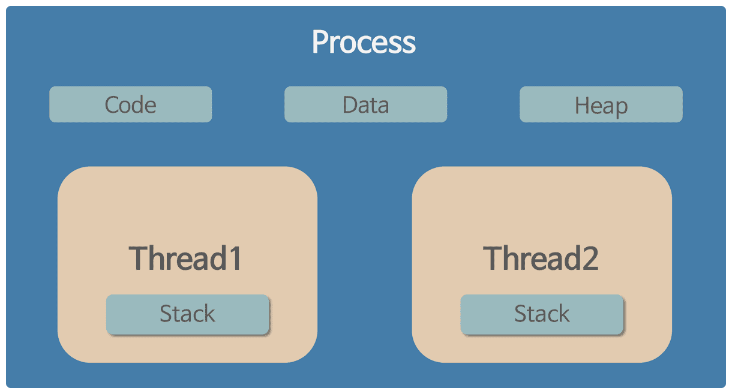

이때 프로세스의 4가지 메모리 영역(Code, Data, Heap, Stack) 중 스레드는 Stack만 할당받아 복사하고  
Code, Data, Heap은 프로세스내의 다른 스레드들과 공유된다. 따라서 각각의 스레드는 별도의 stack을 가지고 있지만  
heap 메모리는 고유하기 때문에 서로 다른 스레드에서 가져와 읽고 쓸 수 있게 된다.

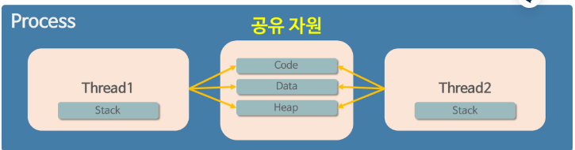

> Info  
> stack은 함수 호출 시 전달되는 인자, 되돌아갈 주소값, 함수 내에서 선언하는 변수 등을  
> 저장하는 메모리 공간이기 때문에, 독립적인 스택을 가졌다는 것은 독립적인 함수 호출이 가능하다 라는 의미이다.  
> 그리고 독립적인 함수 호출이 가능하다는 것은 독립적인 실행 흐름이 추가된다는 말이다.  
> 즉, stack을 가짐으로써 스레드는 독립적인 실행 흐름을 가질 수 있게 되는 것이다.

> Tip  
> 반면에 프로세스는 기본적으로 프로세스 끼리 다른 프로세스의 메모리에 직접 접근할 수는 없다.  

이렇게 구성한 이유는 하나의 프로세스를 다수의 실행 단위인 스레드로 구분하여 자원을 공유하고,  
자원의 생성과 관리의 중복성을 최소화하여 수행 능력을 올리기 위해서다.

#\# 프로세스의 자원 공유
기본적으로 각 프로세스는 메모리에 별도의 주소 공간에서 실행되기 때문에,  
한 프로세스는 다른 프로세스의 변수나 자료구조에 접근할 수는 없다.  
그렇다면 프로세스는 영원히 다른 프로세스 정보에 접근할 수 없을까?

현재 우리가 사용하는 대부분의 컴퓨터 프로그램을 보면 다른 프로그램에 있는 정보를 가져오는 경우는  
심심치 않게 볼 수 있을 것이다. 이처럼 특별한 방법을 통해 프로세스가 다른 프로세스의 정보에 접근하는 것이 가능하다.  
프로세스 간 정보를 공유하는 방법에는 다음과 같은 방법들이 있다.

* IPC(Inter-Process Communication) 사용
* LPC(Local inter-Process Communication) 사용
* 별도로 공유 메모리를 만들어서 정보를 주고받도록 설정

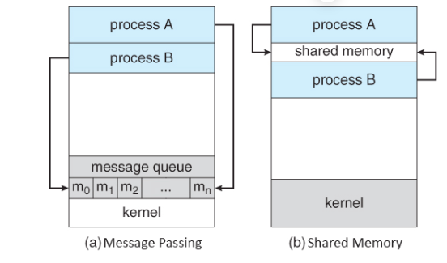

그러나 프로세스 자원 공유는 단순히 CPU 레지스터 교체뿐만이 아니라 RAM과 CPU 사이의 캐시 메모리까지  
초기화되기 때문에 자원 부담이 크다는 단점이 있다. 그래서 다중 작업이 필요한경우  
스레드를 이용하는 것이 훨씬 효율적이라, 현대 컴퓨터의 운영체제에선  
다중 프로세싱을 지원하고 있지만 다중 스레딩을 기본으로 하고 있다.

# 프로세스 & 스레드의 동시 실행 원리
우리가 음악을 들으면서, 웹서핑을 하고, 메신저의 메시지를 확인할 수 있는 이유는  
컴퓨터 내부적으로 프로세스와 스레드를 동시에 처리하는 멀티 태스킹(multi tasking)Visit Website 기술 때문이다.  
하지만 여기서 동시에 처리한다는 것이 심플하게 CPU 프로세서가 프로그램들을 한꺼번에 동시에 돌리는 것으로 생각하겠지만,  
내부적으로 복잡한 원리에 의해 처리가 된다. 그리고 이 원리가 운영체제 이론의 핵심 원리이기도 하다.  
지금부터 그 원리에 대해 파헤쳐 보도록 하자.

## 멀티 코어와 스레드
한번 컴퓨터 견적을 맞춰본 경험이 있는 사람들은 4코어 8쓰레드 CPU에 대한 단어를 본 적이 있을 것이다. 

CPU 한 개는 여러개의 코어를 가질수 있다. 코어는 말그대로 CPU 코어 유닛이다.   
즉, 명령어를 메모리에서 뽑아 해석하고 실행하는 반도체 유닛이 4개가 있는 것이다.  
4코어가 물리적 코어 갯수면, 8쓰레드는 논리적 코어 갯수를 말한다.  
이 경우 물리적 코어 하나가 스레드 두 개 이상을 동시에 실행 가능하다는 의미가 된다.  
즉, 운영체제가 8개의 작업을 동시에 처리할 수 있다는 뜻이다.  
이를 하이퍼스레딩(Hyper-Threading) 기술이라 말한다.

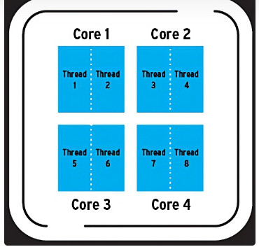

> Tip  
> 단, 여기서 CPU의 쓰레드는 우리가 배운 프로세스의 쓰레드와는 조금 다른 개념이다.  
> 엄밀히 말하자면 CPU의 스레드는 하드웨어적 스레드이고 프로그램의 스레드는 소프트웨어적 스레드로 구분한다.  
> 그런데 우리는 컴퓨터를 이용할때 프로그램을 수십, 수백개를 켜 놓고 이용한다.  
> 그럼 그 수십수백개의 프로세스들을 고작 8개의 논리적인 스레드도 어떻게 처리하는 것일까?
> 이 원리를 알기위해선 병렬성(Parallelism) 과 동시성(Concurrency)이라는 개념을 알고 있어야 한다.  
> 이 개념은 운영체제의 프로세스, 스레드를 이해하는데 있어 가장 핵심 골자가 되는 녀석들이다.

# CPU의 작업 처리 방식
## 병렬성 (Parallelism)
병렬성은 직관적으로 명령어를 메모리에서 뽑아 해석하고 실행하는 반도체 유닛인  
여러개의 코어에 맞춰 여러개의 프로세스, 스레드를 돌려 병렬로 작업들을 동시 수행하는 것을 말한다. 

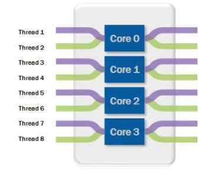

듀얼코어, 쿼드코어, 옥타코어 등등 이런 명칭이 붙는 멀티코어  
프로세서가 달린 컴퓨터에서 할 수 있는 방식이다.

## 동시성 (Concurrency)
동시성은 둘 이상의 작업이 동시에 실행되는 것을 의미한다. 이 '동시' 라는 의미에서  
병렬성과 동시성의 한글 의미가 헷갈릴수 있다. Parallelism가 물리적으로 정말로 동시에 실행하는 것이라고 하면,  
Concurrency는 동시에 실행하는 것처럼 보이게 하는 것으로 이해하면 된다.

즉, 1개의 코어가 있고 4개의 작업이 있다고 가정하다면, 아래 그림과 같이 프로세스들을 ​계속 번갈아가면서  
조금씩 처리함으로써 마치 프로그램이 동시에 실행되는 것 처럼 보이는 것이다.  
이때 프로세스들을 ​번갈아가면서 매우 빠르게 처리하기 때문에  
컴퓨터를 모르는 사람들이 보면 마치 동시에 돌아가는 것처럼 보이게 된다.

단, 이때 작업들을 번갈아가면서 실행할때 작업들을 아주 잘게 나누어 아주 조금씩만 작업을 수행하고  
다음 작업으로 넘어가는 식으로 동작된다. 이렇게 하는 이유는 여러 작업을 동시에 처리하는 것처럼 보이게 만들어,  
사용자에게 더 빠른 반응성을 제공하기 위해서다. 그리고 이렇게 진행 중인 작업들을 A → B → C → D 로  
번갈아 바꾸는 것을 Context Switching 이라고 부른다.

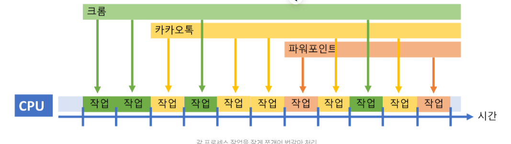

## 동시성이 필요한 이유
그런데 상식적으로 생각해보면 동시성(Concurrency)은  '동시에 돌아가는 것 처럼' 보이는 거지,  
정말 실제로 동시에 돌아가는 것이 아니기 때문에 최종 작업이 걸리는 시간은 거의 차이가 없을 것이다.  
병렬성은 정말로 각 코어에 프로세스를 나눠 실행하는 거니까 듀얼 코어면 반 이상 줄어들텐데 말이다.  
그렇다면 왜 이렇게 번거롭게 작업들을 스위칭 하며 처리하는 것일까?

첫번째는 하드웨어적 한계 때문이라고 할 수있다. CPU 발열 때문에 깡 클럭으로 성능을 올리기에는  
한계에 봉착됬기 때문에 코어의 성능을 올리는 대신 코어를 여러개 탑재하여 쿼드 코어, 옥타 코어 CPU들을 출시하고 있다.  
하지만 아무리 코어를 많이 넣어도 수십개의 코어를 넣은순 없으니 결국 하드웨어적 제한이 걸리게 되고  
수십수백개의 프로세스를 돌리기 위해선 결국 동시성이 필요한 것이다.

두번째는 보다 논리적인 효율적인 이유에서이다. 4코어 8스레드의 CPU 환경에서 현재 총 16개의 작업이 있다고 가정을 해보자.  
그중 8개는 오래 걸리는 작업이고, 나머지 8개는 짧은 시간을 필요로 하는 작업이라고 한다.  
논리적인 8개의 코어이니 최대 8개까지 동시에 실행할수 있을텐데, 만일 최악의 경우 8개의 오래 걸리는 작업이  
먼저 동시에 처리되기 시작했다고 하자. 이 경우 나머지 가벼운 8개의 작업은 처리하는데 짧은 시간이 걸리는 데에도  
불구하고 현재 처리중인 8개의 작업이 다 끝날때 까지 기다려야 할 것이다. 따라서 이러한 비효율적인 면을 극복하기 위해  
작업을 아주 잘게 나눠 번갈아 가면서 처리하는 동시성 개념을 채택한 것이다.

따라서 최대 8개의 작업에 대해서 8개의 논리적인 스레드가 병렬적으로 아주 빠르게 동시적으로 작업을 하면서,  
그보다 많은 수십개의 소프트웨어적 스레드가 있다면 적절히 병렬성과 동시성을 섞어 동시에 돌리게 되게 된다.

# 프로세스 & 스레드의 생명 주기
프로세스와 스레드는 각각의 생명 주기를 가지고 있으며, 운영체제는 이러한 생명 주기를 관리하고,  
프로세스와 스레드를 조정하여 시스템 자원을 효율적으로 사용할 수 있게 된다.

 
## 프로세스 스케쥴링
프로세스 스케줄링(Process Scheduling)은 운영체제에서 CPU를 사용할 수 있는 프로세스를 선택하고,  
CPU를 할당하는 작업을 말한다. 프로세스 스케줄링은 프로세스의 우선순위, 작업량 등을 고려하여 효율적으로 배치하여,  
이를 통해 운영체제는 CPU를 효율적으로 사용하며 시스템 전반적인 성능을 향상시킨다.  
그래서 스케줄링은 멀티 태스킹 작업을 만들어내는 데에 있어서 핵심적인 부분이다.

스케쥴링은 운영체제의 특징과 시스템 요구사항에 따라 다양한 알고리즘 방식으로 동작된다.  
알고리즘 종류로는 대표적으로 FCFS(First-Come, First-Served), SJF(Shortest-Job-First),  
Priority, RR(Round-Robin), Multilevel Queue 등이 있다.

# 프로세스 상태
프로세스의 상태는 프로세스가 실행되는 동안 변경되는 고유 상태를 의미한다.  
프로세스가 생성되어 실행하기 까지 프로세스는 여러가지의 상태를 갖게 되고, 상태의 변화에 따라 프로세스가 동작되는 것이다.  
프로세스는 일반적으로 다음과 같은 5가지 상태를 가진다.

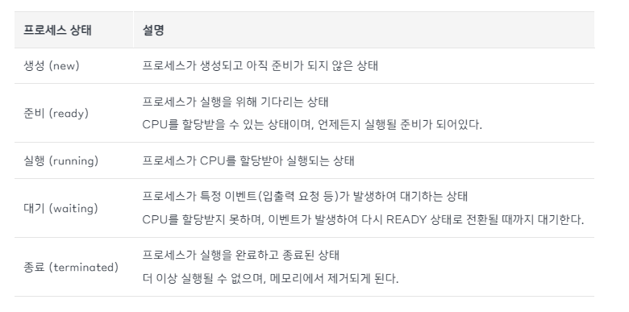

## 프로세스 상태 전이
프로세스 상태 전이란 프로세스가 실행되는 동안 상태가 OS에 의해 변경되는 것을 말한다.  
운영체제는 프로세스의 상태를 감시하고, 프로세스 상태를 기반으로 프로세스 스케쥴링을 통해프로세스를 관리하고 제어한다.  
예를 들어, READY 상태에 있는 여러 프로세스 중에서 어떤 프로세스를 RUNNING 상태로 바꿀지,  
TERMINATED 상태에 있는 프로세스를 제거하고 READY 상태에 있는  
다른 프로세스를 선택할지 스케쥴링 알고리즘에 의해 동작된다.

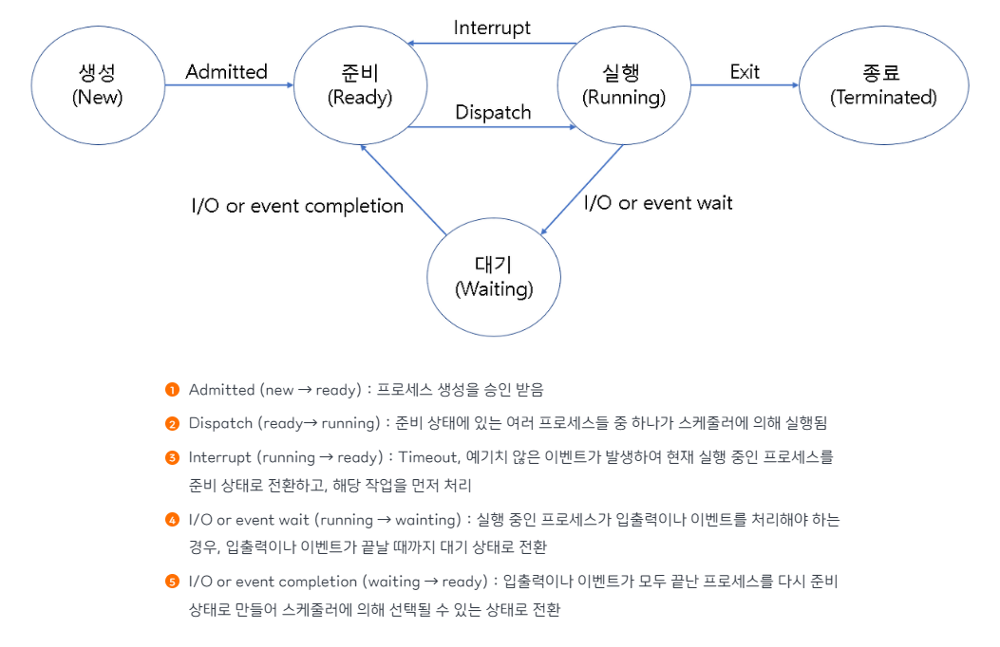

## 프로세스 컨텍스트 스위칭
컨텍스트 스위칭(Context Switching)은 CPU가 한 프로세스에서 다른 프로세스로 전환할 때 발생하는 일련의 과정을 말한다.  
위의 동시성 (Concurrency) 파트에서 다뤘듯이 CPU는 한 번에 하나의 프로세스만 실행할 수 있으므로,  
여러 개의 프로세스를 번갈아가며 실행하여 CPU 활용률을 높이기 위해 컨텍스트 스위칭이 필요한 것이다.

컨텍스트 스위칭을 좀더 구체적으로 말하자면, 동작 중인 프로세스가 대기를 하면서 해당 프로세스의 상태(Context)를 보관하고,  
대기하고 있던 다음 순서의 프로세스가 동작하면서 이전에 보관했던 프로세스의 상태를 복구하는 작업을 말한다.  
이러한 컨텍스트 스위칭이 일어날 때 다음번 프로세스는 스케줄러가 결정하게 된다.  
즉, 컨텍스트 스위칭을 하는 주체는 스케줄러이다.

## PCB (Process Control Block)
PCB(프로세스 제어 블록)는 운영체제에서 프로세스를 관리하기 위해  
해당 프로세스의 상태 정보를 담고 있는 자료구조를 말한다.

프로세스를 컨텍스트 스위칭 할때 기존 프로세스의 상태를 어딘가에 저장해 둬야  
다음에 똑같은 작업을 이어서 할 수 있을 것이고, 새로 해야 할 작업의 상태 또한 알아야 어디서부터  
다시 작업을 시작할지 결정할 수 있을 것이다. 즉, PCB는 프로세스 스케줄링을 위해  
프로세스에 관한 모든 정보 저장하는 임시 저장소인 것이다.

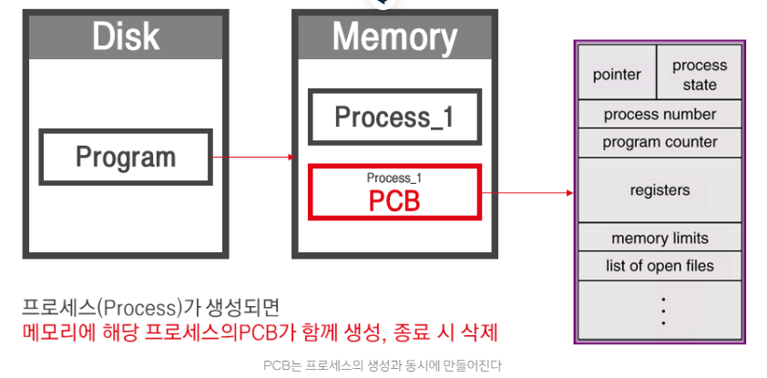

따라서 운영체제는 PCB에 담긴 프로세스 고유 정보를 통해 프로세스를 관리하며,  
프로세스의 실행 상태를 파악하고, 우선순위를 조정하며,  
스케줄링을 수행하고, 다른 프로세스와의 동기화를 제어한다. 

운영체제에 따라 PCB에 포함되는 항목이 다를 수 있지만 일반적으로  
PCB내 에는 다음과 같은 정보가 포함되어 있다.

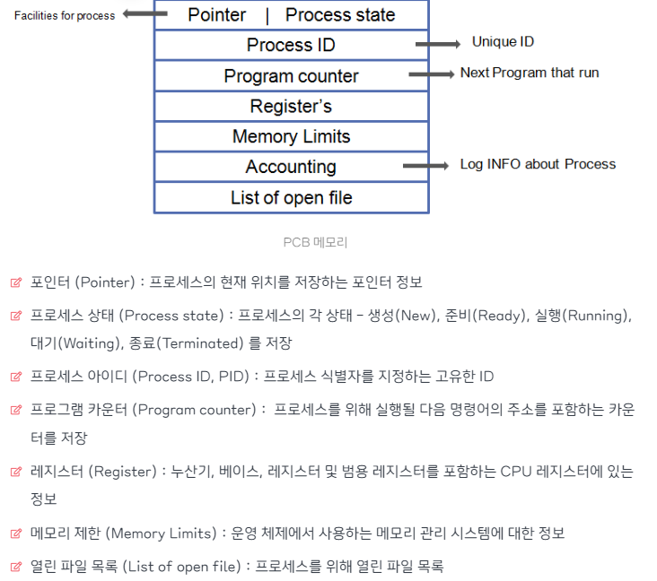

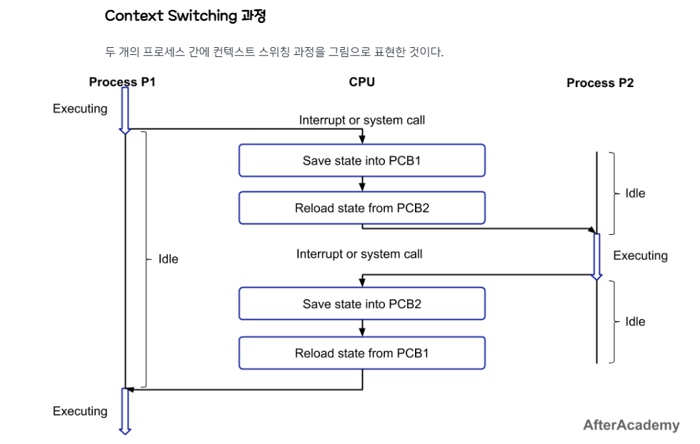

1. CPU는 Process P1을 실행한다 (Executing)
2. 일정 시간이 지나 Interrupt 또는 system call이 발생한다. (CPU는 idle 상태)
3. 현재 실행 중인 Process P1의 상태를 PCB1에 저장한다. (Save state into PCB1)
4. 다음으로 실행할 Process P2를 선택한다. (CPU 스케줄링)
5. Process P2의 상태를 PCB2에서 불러온다. (Reload state from PCB2)
6. CPU는 Process P2를 실행한다. (Executing)
7. 일정 시간이 지나  Interrupt 또는 system call이 발생한다. (CPU는 idle 상태)
8. 현재 실행 중인 Process P2의 상태를 PCB2에 저장한다. (Save state into PCB2)
9. 다시 Process P1을 실행할 차례가 된다. (CPU 스케줄링)
10. Process P1의 상태를 PCB1에서 불러온다. (Reload state from PCB1)
11. CPU는 Process P1을 중간 시점 부터 실행한다. (Executing)

> Info  
> idle(대기) 과 executing(실행) 은 CPU의 동작 상태를 나타낸 것이다

## Context Switching Overhead
이러한 컨텍스트 스위칭 과정은 사용자로금 빠른 반응성과 동시성을 제공하지만,  
실행되는 프로세스의 변경 과정에서 프로세스의 상태, 레지스터 값 등이 저장되고  
불러오는 등의 작업이 수행하기 때문에 시스템에 많은 부담을 주게된다.

위의 컨텍스트 스위칭 과정 그림을 보면 P1이 Execute에서 idle이 될 때 P2가 바로 Execute가 되지 않고  
idle을 상태에 조금 있다가 Execute가 되는걸 볼 수 있다.  
이 간극이 바로 컨텍스트 스위칭 오버헤드(overhead) 인 것이다.

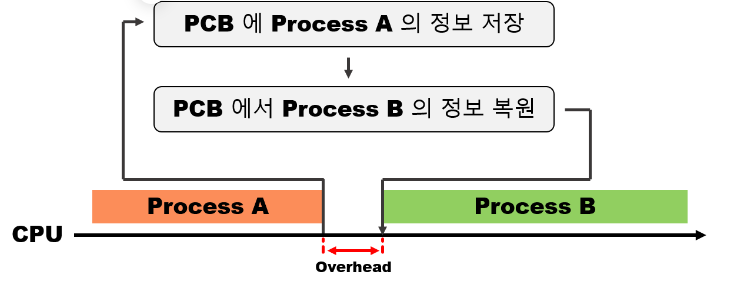

컨텍스트 스위칭 오버헤드는 대표적으로 다음과 같은 행위에 의해서 발생된다.

* PCB 저장 및 복원 비용
* CPU 캐시 메모리 무효화에 따른 비용
* 프로세스 스케줄링 비용

컨텍스트 스위칭 과정에서 PCB를 저장하고 복원하는데 비용이 발생하며,  
프로세스 자체가 교체되는 것이니 CPU의 캐시 메모리에 저장된 데이터가 무효화가 된다.  
이 과정에서는 메모리 접근 시간이 늘어나고, 성능 저하가 발생할 수 있다.  
또한 CPU 스케줄링 알고리즘에 따라 프로세스를 선택하는 비용도 만만치 않다.

바로 뒤에서 다루겠지만, 컨텍스트 스위칭은 꼭 프로세스 뿐만 아니라 여러개의 스레드들 끼리도 스위칭이 일어난다.  
보통 멀티 스레드라고 하면 여러개의 스레드가 동시에 돌아가니 프로그램 성능이 무조건 상승할거라 예상하지만,  
이는 정확하지 않다. 컨텍스트 스위칭 오버헤드라는 변수 때문에 스레드 교체 과정에서 과하게 오버헤드가 발생하면  
오히려 멀티 스레드가 싱글 스레드보다 성능이 떨어지는 현상이 나타날수 있기 때문이다.

# 스레드 스케쥴링
프로세스 스케쥴링과 마찬가지로, 스레드 스케줄링(Thread Scheduling)은 운영체제에서 다중 스레드를 관리하며,  
CPU를 사용할 수 있는 스레드를 선택하고, CPU를 할당하는 작업을 말한다.

스레드의 우선순위, 실행 시간, 입출력 요청 등의 정보를 고려하여 CPU를 사용할 수 있는 스레드를 선택하는,  
스레드 스케줄링 알고리즘은 프로세스 스케줄링 알고리즘과 유사하게 동작한다. 다양한 알고리즘이 있으며,  
대표적으로는 Round Robin, Priority-based scheduling, Multi-level Queue scheduling 등이 있다.  
다만 스레드 스케줄링은 프로세스 스케줄링과 다르게, 하나의 프로세스 내에서 다수의 스레드가 동작하는 형태이기 때문에,  
스레드 간의 상호작용과 동기화 문제를 고려해야 한다는 차이점이 존재한다

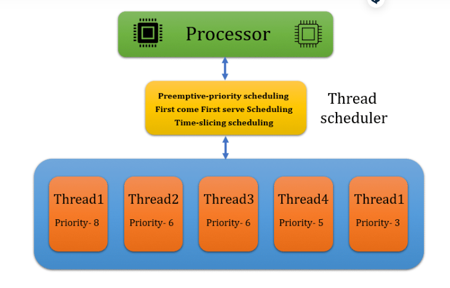

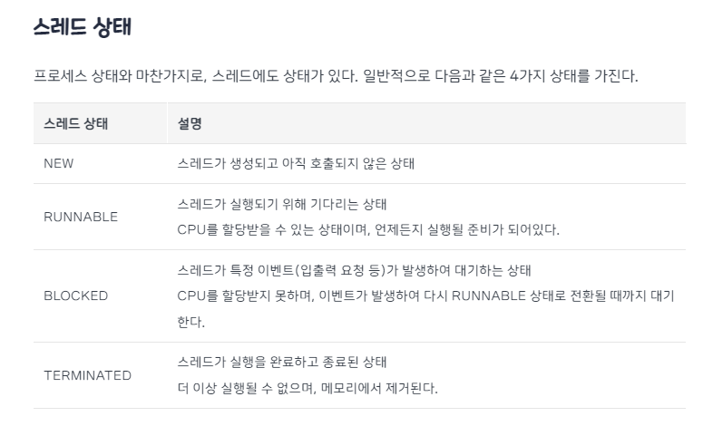

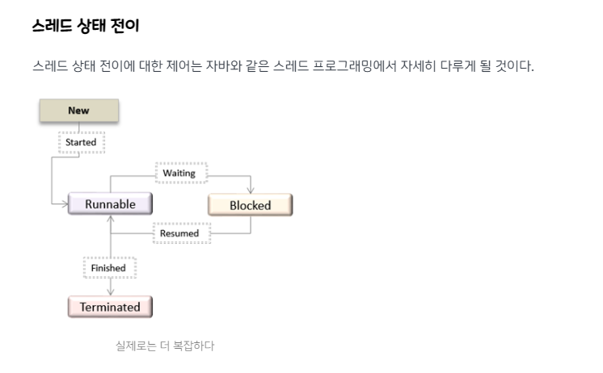

## 스레드 컨텍스트 스위칭
스레드 컨텍스트 스위칭(thread context switching)은 멀티 스레딩 환경에서 스레드 간의 실행을 전환하는 기술이다.  
프로세스 컨텍스트 스위칭과 다른점은 스레드 컨텍스트 스위칭은 하나의 프로내스 내의 스레드들을 교환한다는 점이다.

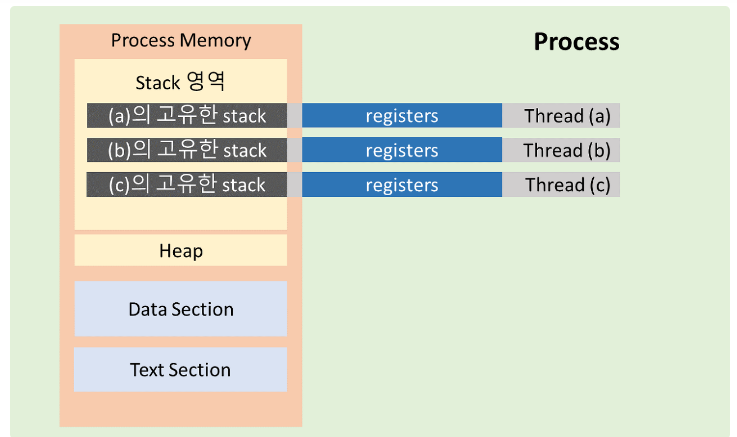

## TCB (Thread Control Block)
PCB 처럼, TCB(스레드 제어 블록)는 각 스레드마다 운영 체제에서 유지하는 스레드에 대한 정보를 담고 있는 자료구조이다.  
그림에서 볼 수 있듯이 TCB는 PCB 안에 들어있다. 스레드가 프로세스 내에 위치한 것 처럼 말이다.

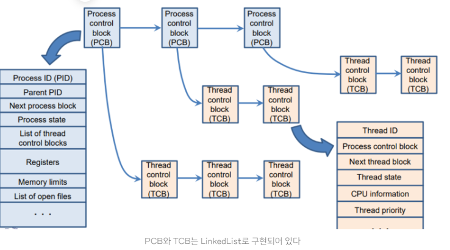

역시 스레드의 상태 정보, 스레드 ID, 스레드 우선순위, 스케줄링 정보 등 다양한 정보를 저장한다.  
TCB도 스레드가 생성될 때 운영 체제에 의해 생성되며, 스레드가 실행을 마치고 소멸될 때 함께 소멸된다.

또한 스레드 간의 자원 공유와 동기화도 TCB를 사용하여 관리된다. 예를 들어, 뮤텍스(mutual exclusion)나  
세마포어(semaphore)와 같은 동기화 기법을 사용할 때, TCB에서 해당 스레드의 뮤텍스나 세마포어 정보를 관리하고,  
스레드가 해당 자원에 대한 접근 권한을 획득하거나 반납할 때 TCB의 정보를 업데이트하게 된다.

> Info  
> 뮤텍스(mutex)  
> 임계 구역에 1개의 스레드만 들어갈 수 있는 동기화 기법.

> 세마포어(semaphore)  
> 임계 구역에 여러 스레드가 들어갈 수 있고, counter를 두어서 허용 가능한 스레드를 제한하는 기법 

# 프로세스 컨텍스트 스위칭 vs 스레드 컨텍스트 스위칭
프로세스 컨텍스트 스위칭과 스레드 컨텍스트 스위칭은 모두 멀티태스킹 환경에서  
여러 프로세스 또는 스레드를 동시에 실행하기 위한 기술이다. 그러나 두 기술은 몇 가지 차이점이 있다.

## 1. TCB가 PCB보다 가볍다

결론부터 말하자면, 스레드 컨텍스트 스위칭이 프로세스 컨텍스트 스위칭보다 더 빠르다.

위에서 프로세스와 스레드의 메모리 섹션에서 다뤘듯이, 프로세스 내의 스레드들은  
text, data, heap 영역 메모리를 공유하기 때문에 TCB에는 stack 및 간단한  
register 포인터 정보만을 저장하기 때문에 PCB보다 TCB가 가벼워 더 빨리 읽고 쓸수 있다.

## 2. 캐시 메모리 초기화 여부
CPU 캐쉬 메모리는 CPU와 메인 메모리 사이에 위치하며 CPU에서 한번 이상 읽어들인  
메모리의 데이터를 저장하고 있다가, CPU가 다시 그 메모리에 저장된 데이터를 요구할 때,  
메인 메모리를 통하지 않고 곧바로 데이터를 전달해 주는 용도이다.

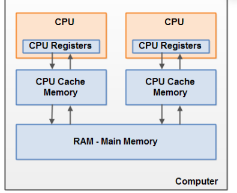

그런데 프로세스 컨텍스트 스위칭이 일어날 경우, 다른 프로세스의 실행으로 인해  
CPU가 새로운 명령어와 데이터를 로드해야 하기 때문에 CPU 캐시 메모리를 초기화 하여야 한다.  
이것이 프로세스 컨텍스트 스위칭에 부담이 되는 요소이다.

스레드 컨텍스트 스위칭일 경우, 프로세스 내 스레드 간에 스택과 레지스터 값 등  
일부 컨텍스트 정보만 변경되므로 CPU 캐시 메모리는 초기화되지 않는다.  
다만 스레드가 다른 CPU 코어에서 실행될 때는 해당 코어의 캐시 메모리에  
스레드 컨텍스트 정보가 로드되어야 하므로 초기화될 수 있다.

## 3. 자원 동기화 문제
스레드 컨텍스트 스위칭이 발생해 다른 스레드가 heap 영역의 공유 데이터에 접근할때,  
이전 스레드가 이미 공유 자원을 사용하고 있는 경우 동기화 문제가 발생할 수 있다.   
예를 들어, 두 개의 스레드가 동시에 하나의 변수를 수정하려고 할 때, 스레드 컨텍스트 스위칭이 발생하면  
변수의 값을 잘못된 값으로 업데이트 할 수 있는 것이다. 이것을 스레드 간에 경쟁 조건 (race condition)이라고 한다.

프로세스는 기본적으로 독립된 공간이지만, IPC와 같은 공유 자원을 사용하는 경우에 똑같이 경쟁 조건이 발생 할 수가 있다.  
예를 들어, 여러 개의 프로세스가 동시에 파일 시스템에 접근하여 파일을 수정하려고 할 때,  
컨텍스트 스위칭이 발생할 때 다른 프로세스가 그 파일에 접근할 수 있기 때문에 파일 내용이 손상될 수 있다.

따라서 이들을 해결하기 위해선 각 상황에 적절한 공유 자원에 대한 동기화 메커니즘이 필요해진다.

# Multi Process 와 Multi Thread 특징
멀티 프로세스와 멀티 스레드는 한 어플리케이션에 대한 처리방식 이라고 보면 된다.  
이름으로 유추할 수 있듯이 멀티 프로세스와 멀티 스레드는 여러개의 프로세스, 스레드가 동작하는 것을 일 컫는다.  
단일이 아닌 다중으로 돌아감으로써 성능 향상 등 여러가지 효과를 얻을 수 있다.  
하지만 또한 이로 인해 발생되는 부가적인 문제점도 발생하게 된다.  
따라서 각각의 장단점을 파악하여 적재적소에 사용하는 것이 요구된다.

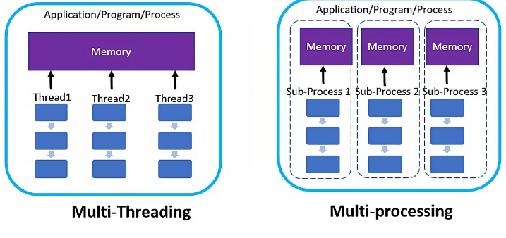

# 참고 자료
[inpa tistory](https://inpa.tistory.com/entry/%F0%9F%91%A9%E2%80%8D%F0%9F%92%BB-%ED%94%84%EB%A1%9C%EC%84%B8%EC%8A%A4-%E2%9A%94%EF%B8%8F-%EC%93%B0%EB%A0%88%EB%93%9C-%EC%B0%A8%EC%9D%B4)
