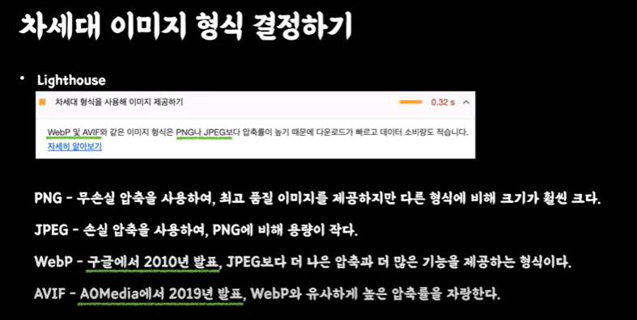
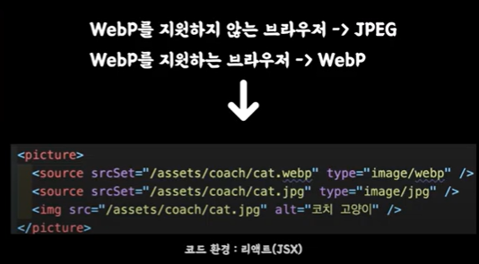
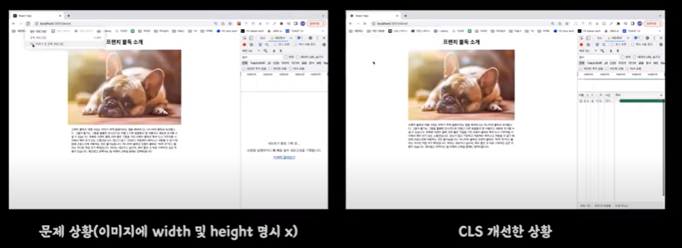
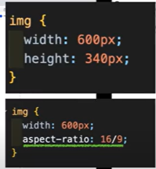
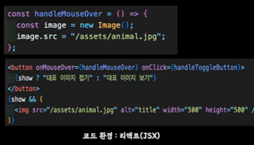

# 웹 성능 개선하기

# 1.WebP 사용
  JPEG 대신 WebP 사용하면 평균 20 30 프로 정도 크기 감소를 시킬 수 있다.  
  (참고 : 나무위키 WebP) WebP 를 지원 안하는 구버전 브라우저도 있기 때문에 점진적으로 대응하는게 좋다.







# 2. 적절한 크기의 이미지 사용하기
* 적절한 크기의 이미지를 게재하여 모바일 데이터를 절약하고 로드시간 단축할 수 있다.

## 화면의 크기에 따라 렌더링하는 이미지의 크기가 달라진다면

## 2-1. 반응형 이미지 제공하기
* srcset: 브라우저에게 제시할 이미지 목록과 그 크기를 정의한다
* sizes: 화면 크기에 따른 어떤 이미지 크기가 최적인지 정의한다.

## 2-2. 이미지 태그에 srcset 속성을 사용하는 이유는 무엇인가요?
* srcset 속성은 사용자의 디스플레이 사양에 따라 다른 해상도의 이미지를 제공함으로써 사용자 경험을 높이기 위해 사용한다. 
* 구체적으로 고사양 디스플레이에는 고품질 이미지를 제공하고 저사양 기기에는 저해상도 이미지를 제공한다.
* 방법은 다음과 같다. img srcset="small.jpg 500w, medium.jpg 1000w, large.jpg 2000w" src="..." alt=""는 클라이언트의 해상도를 계산해, 알맞은 그래픽 이미지를 제공한다. 이미지의 너비가 320px일 때, small.jpg는 500 / 320 = 1.5626, medium.jpg는 1000 / 320 = 3.125, large.jpg는 2000 / 320 = 6.25로 계산한다. 해상도가 1.xx일 경우 small.jpg을 선택하고 해상도가 2.xx인 경우 그 이상의 값을 제공하는 medium.jpg를 사용한다. 이처럼 srcset 속성을 통해 클라이언트의 해상도에 따라 브라우저에 small, medium, large .jpg 그래픽을 표시하도록 지시할 수 있다. 


# 3. Image CDN 활용하기
* 기본 CDN 기능에서 이미지를 제공하는데 특화된 CDN이다.
* 이미지 압축, 최적화 기능이 탑재되어 있다.

# 4. CLS(누적 레이아웃 변경) 개선하기
* 이미지 요소에 명시적인 너비 및 높이를 설정하여 레이아웃 변경 횟수를 줄이고 누적 레아아웃 변경을 개선합니다.

## 누적 레이아웃 변경이란?
* 사용자가 예상치 못한 에이아웃 이동을 경험하는 빈도를 수량화하고 시각적 안정성을 나타내는 지표이다.






# 5. Lazy Loading 활용하기
Html의 loading 옵션을 이용하거나 Intersection Observer를 활용해서  
적시에 이미지를 로드 하도록 해서 초기 데이터 비용을 아낄 수 있다


# 6. Pre Loading 활용하기
* 마우스 커서만 대도 이미지 업데이트




# 7. 이미지 스프라이트
이미지 스프라이트는 여러 개 이미지를 하나로 만들고, CSS의 background-position 속성을 사용해 부분 이미지를 사용하는 방법이다.   
아래 이미지와 같은 아이콘들을 8번 호출해서 가져 오는게 아니라 한번 호출해서 잘라서 사용하면 호출 횟수를 줄일 수 있다.

# 8. Base64 대체
웹 페이지에서 사용하는 아이콘 이미지 개수가 적은 경우, 다운로드한 이미지를 사용하는 대신 이미지를 Base64로 변환해서   
HTML, CSS에 포함해 사용할 수 있다. 이 경우 브라우저 캐싱이 안되므로 주의하도록 하자. 

```css
.btn {
  background: url('data:image/png;base64,iVBORw0KGgoAAAANSUhEUgAAAAwAAAAOCAYAAAAbvf3sAAAAAXNSR0IArs4c6QAAAHBJREFUKBVjYBimICwsLAaEsXmPGV0QqnAeUNxfW1v7/tWrVy8hq0HRgKQ4CahoIxDPQ9cE14CseNWqVUtAJoMUo2tiBFkXGRmp9/fv3zNAZhJIMUgMBmAGMTMzmyxfvhzhPJAmmCJ0Gp8cutqhwAcASWgwk+79LiQAAAAASUVORK5CYII=')
    no-repeat 0 0;
}
```

# 참조
[록바의 웹 성능 개선하기 - 이미지](https://www.youtube.com/watch?v=INPldifIEXE)

[helloinyong tistory](https://helloinyong.tistory.com/297)
