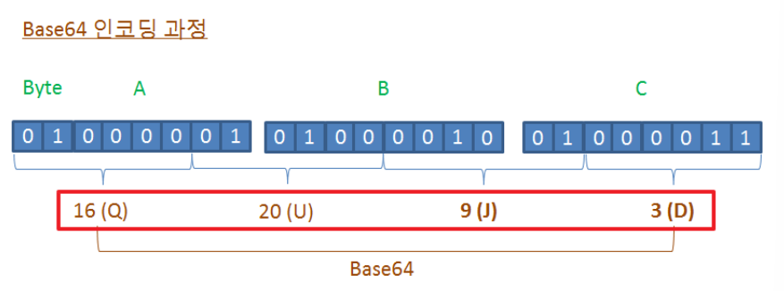
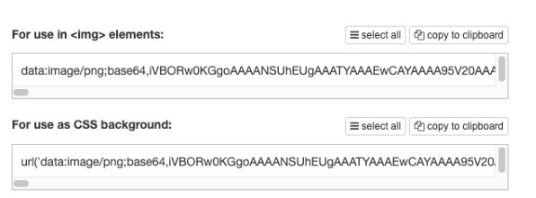
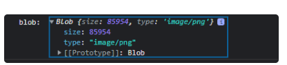
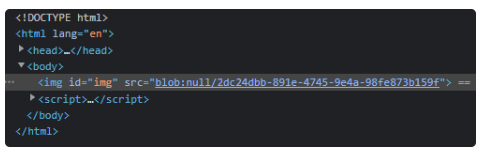
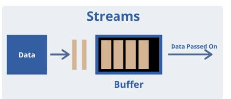
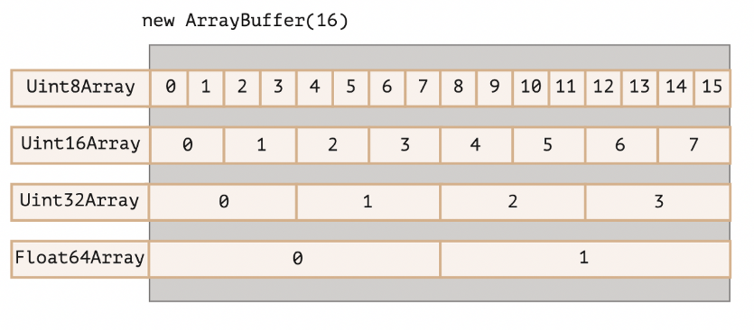
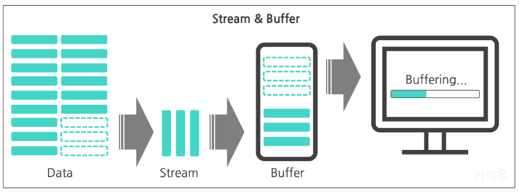

# 이진 데이터
웹 개발을 진행하다 보면 이진 데이터를 다루어야 할 때를 간혹 마주칠 수 있다.

브라우저에선 주로 파일 생성, 업로드, 다운로드 또는 이미지 처리와 관련이 깊고,  
서버 사이드인 node.js 에선 파일 부터 버퍼 까지 원시 데이터를 다루는 상황이 있을 수 있다.

 

우리가 평소에 프로그래밍 하면서 직접 이진 데이터를 다루는 일은 별로 없다.

고급 언어를 사용해 프로그래밍 하기 때문에 사람이 읽을수있는 자연어로 코딩해두면,  
내부적으로 프로그램이 알아서 이진 데이터로 변환하여 읽고 처리하기 때문이다.

하지만 정수, 실수, 문자가 아닌 파일이나 이미지,  
비디오 같은 멀티미디어 같은 데이터를 다루어야 할때는 난감해진다.

이 멀티미디어 데이터를 정수, 문자 다루듯이 해야되는데  
이진 데이터를 0과 1로 다룰수있는 것도 아니고 어떻게 할까

이번 포스팅에서는 한번쯤 IT업계에 종사해봤으면 들어본  
binary, base64, blob, arraybuffer, buffer, file 타입에 대해서 개념을 알아보고  
자바스크립트에서 지원하는 내장 객체를 이용해 이미지 멀티미디어 파일을  
어떤 문법을 이들을 변환하고 이용할수 있는지 알아보는 시간을 가져볼 것이다.

# Binary
여러분도 아시다싶이, 컴퓨터는 우리가 사용하는 모든 데이터를 0과 1로 저장한다.

Binary(바이너리)란 이진 데이터를 의미하며,  
'1'과 '0'만을 사용하여 2개의 수를 나타내는 진법을 뜻하는,  
컴퓨터(프로그래밍)을 다루는데 있어 가장 근본이 되는 체계라고 볼수 있다.

# Base64
컴퓨터는 모든 데이터를 0과 1로 저장한다고 말했다.  
우리가 지금 보고 있는 브라우저 역시 0과 1로 이루어져 있는 것이며  
폴더나 파일 역시 이진 데이터로 이루어진 것이다.

그럼 컴퓨터 안에 저장된 데이터를 꺼내 쓰고 싶을때 어떻게 해야 할까?

우리가 프로그래밍에서 배우는 변수 개념이 바로 이 개념이다.  
메모리에 저장된 0과 1로 이루어진 데이터를 변수에 적재해놓고,  
필요하면 우리는 변수를 불러 덧셈, 뺄셈을 하는 것으로 컴퓨터 안의  
이진 데이터(바이너리)를 다루고 있었던 것이다.


숫자나 스트링이 아닌, 이미지나 비디오 같은 복잡한 멀티미디어 파일들은  
어떻게 변수에 메모리에 저장할까?

변수에 이미지 url을 저장하는건 링크라는 징검다리를 저장하는거지  
이미지 데이터 그 자체를 저장하는 것이 아니다.

이때 등장하는 것이 Base64 라는 개념이다.

Base64는 0과 1로 이루어진 이진 데이터(바이너리)를 인코딩하여  
텍스트 형식으로 변환하는 것을 말한다.

 

예를들어 아래 사진과 같이 실제 html에 img의 src에 이미지 url이 아닌 숫자와  
문자로 구성된 긴 코드(data:image/png;base64)가 들어간 경우를 본적이 있을 텐데  
이것이 바로 base64 이다.

0과 1로 이루어진 이미지 데이터 자체를 base64 텍스트 기반 포맷으로 변환해줌으로서  
우리가 직접 이미지 데이터를 다룰수 있는 것이다.

쉽게 이해해 보자면, 만일 우리가 소스 코드단에 이미지를 불러와 다루어야 한다고 하자.

보통이라면, 링크를 통해 불러오거나 혹은 로컬 폴더에 저장되어있는  
이미지 파일을, 코드에서 제공하는 파일시스템을 통해 상대경로로 불러와  
다뤄본 경험이 있을 것이다. 하지만 파일도 결국 url과 같이 OS에 저장된  
징검다리를 불러온 것 과 다름이 없다.

 

그러나 base64로 변환해주면 우리가 직접 소스 코드단에  
이미지 데이터 자체를 저장할 수 있게 된다.

우리가 변수에 문자열이나 숫자를 저장하는 것 처럼,  
변수에 이미지를 저장할 수 있는 것이다.

base64는 이미지 데이터 값을 변환하는게 아닌 그냥 출력 형식을 변환하는 것이기 때문에  
이미지 자체가 바뀌는 것이 아니니 가능한 것이다.

즉, 이미지 데이터 정보는 이미 base64 텍스트 자체에 포함되어 있기때문에,  
결과적으로 링크 url을 통해  서버에 요청하지 않고도 직접 이미지를 사용할 수 있게 된다.  
(소스 코드 단에 이미지 데이터가 저장되어 있는 형태)

 
보통 위와 같이 html에서 직접 base64 이미지 포맷을 다루는 경우는 다음과 같다.

1. 크기가 작은 이미지를 url이나 파일 불러오는 것 없이 html에 직접 삽입하는 경우
2. 간단한 페이지를 작성해 임시로 이미지를 사용하는 경우
3. 이미지가 들어간 메일 내용을 html으로 작성해서 보내는 경우


이미지 같은 파일을 문서 (Html, JS, CSS) 에 인라인으로 작성하여 사용
 
이렇게 base64로 변환하면 직접 바이너리를 다룬다는 특징도 있지만,  
바이너리 데이터를 텍스트로 바꾸는 64진법 인코딩을 통해, 바이너리 데이터 대비  
33%의 데이터의 양 증가하게 된다는 단점이 있다.

하지만 데이터의 길이가 증가함에도, Base64를 사용하는 가장 큰 이유는  
앞서 소개하듯이 Binary 데이터를 텍스트 기반 규격으로 다룰 수 있기 때문이다.

 

또한 순수 바이너리 형식으로 남아있는보다 전송/저장이 훨씬 쉽다는 점도 꼽을 수 있다.  
(이진 데이터는 손상될 확률이 높다)

인코딩 할시, 문자 포맷을 A-Z,a-z,0–9,/+ 만을 사용하기 때문에,  
문자 포맷이 달라 데이터를 손상시킬 수있는 시스템 간에도 안정적으로 전송 될 수 있다.


지금까지의 base64 포맷에 대해 정리하자면 다음과 같다.

* 별도 이미지 파일이 필요없다. 왜냐하면 base64 데이터 자체가 이미지이기 때문.
* 브라우저 렌더링시, 문서로딩과 같이 로딩 되기에 끊기지 않고 불러온다. 또한 네트워크가 좋지않아도 위와 같은 특징으로 이미지를 로딩할수 있다는 점도 있다.
* 문자열이 매우매우 길기에 가독성이 떨어진다.
* Base64 인코딩을 사용하면 원본보다 33%의 용량이 커져서, 남용할경우 오히려 로딩 속도가 저하될 수 있다.


# 자바스크립트 프로그래밍
자바스크립트 코드를 이용해 변환하는 방법은 다음과 같다.

먼저 fetch api로 이미지를 읽어들이고,  
이미지를 blob 형식으로 변환한다 (blob은 바로 뒤에서 배운다)

그리고 FileReader 객체를 통해 blob 데이터를 base64 형식으로 읽어들어 변환시킨다.

> Tip  
> FileReader는 Blob 또는 File과 같은 자료형 객체로부터 데이터를 읽어 들이기위한 목적으로 사용되는 객체이다.  
> 읽어들인 데이터는 주로 이벤트를 사용하여 필요한 타이밍에 데이터를 전달한다. (밑에서 자세히 배운다)

```JAVASCRIPT
(async () => {
    const data = await fetch('https://play-lh.googleusercontent.com/hYdIazwJBlPhmN74Yz3m_jU9nA6t02U7ZARfKunt6dauUAB6O3nLHp0v5ypisNt9OJk');
    const blob = await data.blob();
    const reader = new FileReader();
    reader.onload = () => {
        const base64data = reader.result;
        console.log(base64data)
    }
    reader.readAsDataURL(blob);
})()
```


# Blob (Binary Large Object)
BLOB은 Binary Large OBject의 약자로 주로 이미지, 오디오, 비디오와 같은  
멀티미디어 파일 바이너리를 객체 형태로 저장한 것을 의미한다.

멀티미디어 파일들은 대다수 용량이 큰 경우가 많기 때문에,  
이를 데이터베이스에 효과적으로 저장하기 위해 고안된 자료형이라 볼 수 있다.  
(string 타입, number 타입이 있듯이 blob 타입이 있다고 이해하면 된다)

예를들어 데이터베이스에 이미지 파일을 그대로 데이터로 저장하고 싶을때,  
바로 blob 포맷으로 변환한 뒤 저장하는 것이다.

브라우저 환경에서도 자바스크립트를 이용해 이러한 blob 데이터에 접근하고 사용할 수 있다.  
주로 자바스크립트에서 텍스트, 이미지, 사운드, 비디오와 같은  
멀티미디어 데이터를 다룰 때 사용한다.


 

좀더 이해하기 쉽게, base64와 어떤점이 다른지 비교해보자.

* base64는 바이너리 데이터를 다루기 위해 텍스트(문자열) 형태로 저장한 포맷이라고 했었다.
* blob이란 바이너리 데이터를 다루기 위해 객체(Object) 저장하는 것이다.

앞서 base64 포맷으로 이미지 바이너리 파일을 브라우저에서 표현하려면,  
FileReader 객체를 이용해 변환후 \ 태그의 src 속성에 넣으면 가능했었다.

하지만 다음과 같이 문자열이 굉장히 길어져 가독성이 안좋을 뿐만 아니라,  
base64 이미지를 이곳저곳 여러개 사용할 경우 결과적으로 용량 문제 때문에(33% 커진다)  
문서 자체를 로딩하는데 많은 시간이 걸려 오히려 느려질수 있다는 단점을 지니고 있다. 

하지만 blob 데이터는 적절하게 object url로 변환만 해주면  
다음과 같이 심플하게 브라우저에서 사용할수 있다.

그리고 blob은 객체이기 때문에 다양한 코드 활용성을 지니고 있어,  
base64로 변환할수도 있고 뒤에서 배울 buffer로도 변환할수도 있다.




## blob 이미지 다루기
본격적으로 이미지 파일을 blob으로 변환해 다뤄보는 실습을 가져보자.

다음은 이미지를 fetch api로 받아와 blob 포맷으로 변환하는 코드이다.

```JAVASCRIPT
const data = await fetch('https://play-lh.googleusercontent.com/hYdIazwJBlPhmN74Yz3m_jU9nA6t02U7ZARfKunt6dauUAB6O3nLHp0v5ypisNt9OJk');
const blob = await data.blob(); // 이미지 blob 객체 얻기
```


## Blob → ObjectURL 변환
이렇게 만들어진 Blob 객체는 곧바로 사용할수 있는 것이 아니고,  
\<a>, \ 태그의 src 속성에 사용할 수 있는 url 타입으로 따로 변환을 해야한다.

```HTML
 
<a download="img.jpg" href="#">이미지 다운로드</a>
 
<script>
    fetch('https://www.business2community.com/wp-content/uploads/2014/04/Free.jpg')
      .then((response) => response.blob())
      .then((blob) => {
        const url = URL.createObjectURL(blob);
        document.querySelector('img').src = url;
        document.querySelector('a').href = url;
      });
</script>
```

URL.createObjectURL 메서드를 이용하면  
Blob 객체를 가지고 고유한 URL을 생성할 수 있다.

이때 생성되는 URL의 형태는 blob:/의 형태를 띄게 된다.  
그리고 변환된 URL은 source(src)를 속성으로 가지는  
모든 HTML 태그와 CSS 속성에서 사용 가능하다.

Blob 객체에는 별도로 type(image/png) 을 명시하기 때문에  
Blob 객체를 다운로드/업로드 하는 과정에서 네트워크 요청에서의  
Content-Type은 자연스레 명시된 type으로 매칭된다.

이때 변환된 URL은 현재 탭의 브라우저 메모리에 저장되고,  
저장된 URL은 매핑된 Blob 객체를 참고하고 있는 형태이다.  
이러한 원리 때문에, base64와는 달리 짧은 문자열만으로도 원래의 Blob 객체에 접근이 가능하고 그에 따른 이미지 등의 파일을 가져올 수 있는 것이다.

그래서 변환된 URL은 항상 현재 문서에서만 유효하다.  
(현재 브라우저 메모리에 적재된 상태니까)

변환된 URL을 현재 문서를 새로고침하거나 아니면  
다른 페이지에서 사용하려고 한다면 제대로 사용할 수 없다.

 
**그러나 이와 관련한 메모리 이슈가 조재한다.**

Blob 객체가 URL로 변환되어 매핑이 이루어진 채 메모리에 저장되게 되면,  
명시적으로 해당 URL이 해제되기 전까지 브라우저는 해당 URL이 유효하다고 판단하기 때문에  
자바스크립트 엔진에서 가비지 컬렉션이 이루어지지 않는다.

따라서 blob URL을 사용한 이후, 더 이상 사용하지 않을 시점이라고 판단되면  
명시적으로 해제해 주는 것이 좋다.

```
// Create Blob URL
const objectURL = window.URL.createObjectURL(blob);
 
// Revoke Blob URL after DOM updates..
window.URL.revokeObjectURL(objectURL);
```

변환은 URL.createObjectURL 메서드를 통해 진행했고,  
해제의 경우에는 URL.revokeObjectURL 메서드를 사용한다.

이는 내부적으로 매핑되어 있는 참조를 지우는 메서드로,  
메모리에 상주하고 있는 Blob 객체를 지울 수 있다.

예를 들어 이미지를 화면에 출력이 아닌 오로지 이미지 다운으로 blob을 사용한다고 하면,  
동적으로 생성한 Blob 객체는 오직 다운로드 클릭 순간에만 필요하고  
그 이후엔 필요하지 않기 때문에 해제를 통해 메모리 누수를 방지할 수 있다.


## Blob → Base64 변환
앞서 말했듯이 Blob 객체로 base64의 형태로 변환이 가능하고,  
변환된 문자열을 바로 src 로써 사용할 수 있다.

이러한 URL은 보통 data url 이라고 부르는데,  
이렇게 변환된 base64 형태의 URL은 위에서 URL.createObjectURL 메서드를 통해  
변환한 형태와는 달리 어디에서나 사용이 가능하다. (문자열 자체가 이미지 데이터 이기 때문에)

Blob 객체를 base64로 인코딩 하여 사용하는 방식은 위 base64 소개 파트에서 다뤘었다.

```JAVASCRIPT
fetch('https://play-lh.googleusercontent.com/hYdIazwJBlPhmN74Yz3m_jU9nA6t02U7ZARfKunt6dauUAB6O3nLHp0v5ypisNt9OJk')
    .then((res) => res.blob())
    .then((blob) => {
        const reader = new FileReader();
        reader.onload = () => {
            const base64data = reader.result;
            console.log(base64data)
        }
        reader.readAsDataURL(blob);
    })
```

> Tip  
> Blob 객체를 URL로 변환하는 두 가지 방식 모두 활용도가 높다.  
> 하지만 base64로 인코딩 하는 경우엔 문자열의 길이가 매우 길어질 수 있다는 점과  
> URL.craeteObjectURL 메서드보다 더 느리다는 점이 있는 반면,   
> 변환된 data url은 현재 탭의 문서뿐만 아니라 어디에서도 유효하다는 장점이 있다.


# ArrayBuffer
ArrayBuffer 객체는 이미지, 동영상과 같은 멀티미디어 데이터 덩어리를  
표준 자바스크립트(브라우저)에서 다루기 위해 도입됬다.

일반적으로 실시간 방송과 같이 영상내용을 송출할 때에는,  
영상이라고 하는 실시간 데이터를 계속해서 전달해줘야 유저들이 이것을 볼 수 있다.

즉, 어떤 식으로든 커다란 데이터를 잘개 쪼개서 전송해야 하는 상황이 발생한다는 것이다.



여기서 버퍼(buffer) 라는 개념이 등장 하는데, 일정 구획만큼의 데이터를 쪼개서  
전달되는 stream을 저장한 후 일정 크기가 도달하면 출력장치나  
동영상 플레이어로 전달해주는 중개자 역할을 하는 객체라고 보면 된다.  
(버퍼링이 바로 이 개념이다)

따라서 자바스크립트 용도가 다양해지면서 이처럼 오디오나 비디오와 같은  
binary data들 역시 다룰 필요성이 생기게 되자,  
필요한 메모리 공간을 적절하게 할당해서 사용할 수 있는 유연성이 필요해  
ArrayBuffer를 만들게 되었다고 이해하면 된다.


ArrayBuffer는 자바스크립트에서 원시 데이터(바이너리 데이터)를 직접 다루는 수단으로 사용되며,  
이는 메모리를 개발자가 수동으로 관리할 수 있게 해준다.

지금까지 배운 base64와 blob은 사람이 읽고 다루기 편하게 가공된 데이터 타입이라면,   
ArrayBuffer 보다 오리지널에 가깝다고 보면 된다.

레퍼런스 타입으로 되어있고, 고정된 길이의 연속된 메모리 공간을 할당해  
사용하겠다고 알려주는 역할을 한다.  
(참고로, 오디오 전용인 AuidoBuffer, 미디어 전용인 SourceBuffer도 있다고 한다)

특히 성능에 민감한 이슈를 다룬다거나, 아니면 Blob 등의 큰 용량의 파일 데이터를 다루는 경우에  
ArrayBuffer를 사용해 유연하고 효율적으로 작업할 수 있다.

 
ArrayBuffer는 연속된 공간의 메모리에 할당되는 고정 길이에 대한 참조 객체이다.

해당 객체는 다음과 같이 생성할 수 있다.

```JAVASCRIPT
let buffer = new ArrayBuffer(16); // 16 바이트 크기의 buffer를 생성
buffer.byteLength; // 16
```

이때 생성된 buffer 객체는 연속된 16 바이트 메모리 공간을 차지하고 있으며,  
초기값은 모두 0으로 채워져 있다. 


> Tip  
> 참고로, 이름에 array가 있다고 하여 ArrayBuffer가 자바스크립트 배열이라고 착각하면 안된다.  
> ArrayBuffer는 그저 메모리의 연속된 공간을 차지하고 있는 추상적인 메모리 계층과도 같다.  
> ArrayBuffer는 자바스크립트의 배열과 비교해 다음과 같은 차이점이 있다.  
>   - 고정길이를 가지고 있고, 이를 늘이거나 줄일 수 없다.  
>   - 정확히 명시된 크기만큼의 공간을 메모리에서 차지한다.    
>   - 각각의 바이트에 접근하기 위해서는, 일반 배열처럼 buffer[index]와 같이 인덱스를 통해 
>     접근할 수 없다. 대신에 view라고 불리는 별도의 객체를 생성해서 접근해야 한다.


일반적으로 Array 같은경우 그냥 곧바로 접근해서 배열 안의 데이터를 조작할수 있지만,

ArrayBuffer에 대한 접근 및 조작은 항상 view라고 불리는 객체를 따로 생성해서 수행해야 한다.

view 객체는 자기 스스로는 어떠한 데이터도 저장하고 있지 않고,  
그저 ArrayBuffer의 내부를 들여다보기 위한 수단으로 사용한다.  
(이들은 보통 TypedArray 라는 용어로 표현한다)

다음은 ArrayBuffer에 있는 각 바이트를 개별적으로 다루는 view 객체 종류이다.

* Uint8Array : 숫자 8은 비트를 의미하고 8비트 = 1바이트이기 때문에 각 바이트별로 접근이 가능하다. 1바이트 크기이기 때문에 0 - 255 범위의 수를 다룰 수 있다. (Uint8의 의미는 Unsigned 8bit Int와도 같다)
* Uint16Array : 2바이트(16비트) 단위 정수형으로 접근이 가능한 view 객체이다. 따라서 다룰 수 있는 범위는 0 - 65535에 해당한다.
* Uint32Array : 4바이트(32비트) 단위 정수형으로 접근이 가능한 view 객체이다. 따라서 다룰 수 있는 범위는 0 - 4294967295에 해당한다.
* Float64Array : 8바이트(64비트) 단위로 부동 소수점 방식으로 접근이 가능한 view 객체이다. 다룰 수 있는 범위는 5.0x10^-324 부터 1.8x10^308 까지이다.



```jsx
let buffer = new ArrayBuffer(16);
let view = new Uint32Array(buffer);
 
// buffer은 [00000000 00000000 ...... (총 16개)] 로 형성되어있고
// view가 이것을 인식할 때 4바이트씩, 즉 8개짜리 4개씩 단위로 끊어 읽는다는 소리다.
// [00000000 00000000 00000000 00000000, 00000000 00000000 ......]
 
console.log(view.length); // 분할해서 읽는 공간의 갯수가 총 4개 (16바이트 / 4바이트)
console.log(view.byteLength); // 총 바이트크기는 16바이트
 
// view를 통해 값을 입력
view[0] = 123456; // 분할공간 중 첫번째에 123456이라는 숫자데이터를 넣는다
 
for (let num of view) {
  console.log(num);	// 123456, 0, 0, 0
}
```

> Tip  
> ArrayBuffer에 의해 구현된 객체는 데이터 부분을 나타내고,   
> view는 문맥을 제공해 실제 데이터 형식화 배열로 바꾼다.


# Base64 → ArrayBuffer → Blob
base64 데이터를 blob으로 바꾸기 위해 중간 과정으로 arrayBuffer가 쓰인다.

```JAVASCRIPT
// bas64를 blob으로 변환해주는 함수
function b64toBlob(b64Data, contentType = '', sliceSize = 512) {
   const image_data = atob(b64Data.split(',')[1]); // data:image/gif;base64 필요없으니 떼주고, base64 인코딩을 풀어준다
 
   const arraybuffer = new ArrayBuffer(image_data.length);
   const view = new Uint8Array(arraybuffer);
 
   for (let i = 0; i < image_data.length; i++) {
      view[i] = image_data.charCodeAt(i) & 0xff;
      // charCodeAt() 메서드는 주어진 인덱스에 대한 UTF-16 코드를 나타내는 0부터 65535 사이의 정수를 반환
      // 비트연산자 & 와 0xff(255) 값은 숫자를 양수로 표현하기 위한 설정
   }
 
   return new Blob([arraybuffer], { type: contentType });
}
 
const contentType = 'image/png';
const b64Data = 'baset64_데이터'
 
const blob = b64toBlob(b64Data, contentType); // base64 -> blob
const blobUrl = URL.createObjectURL(blob); // object url 생성
 
const img = document.createElement('img');
img.src = blobUrl;
document.body.appendChild(img);
```
 

## Blob → ArrayBuffer
정통적인 FileReader 객체로 변환할수도 있고,

```JAVASCRIPT
let fileReader = new FileReader();
 
fileReader.readAsArrayBuffer(blob); // ArrauBuffer 형태로 데이터를 읽어 변환
 
fileReader.onload = function(event) {
  let arrayBuffer = fileReader.result;
};
```
 

대용량 blob일경우 프로미스를 이용해 비동기로도 처리할 수 있다.

```JAVASCRIPT
const blob = new Blob(...);
const buf = await blob.arrayBuffer(); // 비동기로 arrayBuffer로 변환 (대용량 일경우)
```
 

편법으로 blob을 ObjectURL로 바꾸고 fetch로 요청해서 한방에  
arraybuffer로 변환하는 방법도 존재한다.

```JAVASCRIPT
// 한방에도 가능
fetch(URL.createObjectURL(myBlob))
	.then(res => res.arrayBuffer())
```


# Buffer 
데이터 덩어리를 다루기 위해 Node.js는 진작부터 Buffer 타입을 도입했다

버퍼는 고정된 크기의 데이터 덩어리를 표현하기 위한 타입이며,  
Node.js 의 많은 API들이 Buffer 타입을 지원한다.

fs 모듈로 로컬 파일을 가져오는 것도 사실 버퍼로 가져오는 것이다.

클라이언트단에서 ArrayBuffer로 이진 데이터를 다루었다면,  
서버단(Node.js)에서는 Buffer 객체로 이진 데이터를 다룬다고 이해하면 된다.

> Tip  
> Node.js에서 멀티미디어 파일을 다룬다고 하면 무조건 버퍼를 이용해 다룬다 라고 이해하면 된다.  



# 서버단에서 이미지 가져와 다루기
로컬에서 이미지 파일을 가져오면 바로 버퍼로 변환되서 복잡한 과정없이  
바로 서버에서 이미지를 다룰수 있겠지만, 서버에서 ajax로 이미지를 불러오고  
이를 다루기 위해서는 위에서 배운 blob, arraybuffer가 필요하다.

```JAVASCRIPT
const fetch = require('node-fetch');
 
//* 이미지 가져오기
const img = await fetch('이미지URL 혹은 base64이미지') // 이미지 url을 fetch
  .then((res) => res.blob()) // 반환 이미지를 blob으로 변환
  .then(async (blob) => {
     const arrayBuffer = await blob.arrayBuffer(); // blob을 arrayBuffer로 변환
     return Buffer.from(arrayBuffer); // 클라이언트용 버퍼인 arrayBuffer룰 다시 서버용 buffer로 변환
  });
```

1. 이미지를 fetch한다
2. 그리고 결과값을 blob으로 변환해준다
3. blob을 비동기를 통해 arraybuffer로 변환해준다
4. arraybuffer을 buffer로 변환해준다 (blob을 buffer로 바로 변환이 안되기 때문에 이와 같은 과정을 이행)


사실 fetch 모듈에서 바로 버퍼로 변환할수 있는 헬퍼 메서드를 제공하니  
아래와 같이 간단하게 사용하면 된다. (그래도 내부적으로는 위와 같이 동작된다. 공부함 보람?!)

```JAVASCRIPT
const fetch = require('node-fetch');
 
const img = await fetch(이미지URL 혹은 base64이미지) // 이미지 url을 fetch
      .then((res) => res.buffer()) // 반환 이미지를 blob으로 변환
```

# File & FileReader
파일은 우리에게 매우 익숙한 타입이지만,  
자바스크립트에서의 File 객체는 Blob 객체를 확장한 객체로  
주로 파일시스템과 관련된 기능을 담당한다.

파일시스템은 OS/서버단의 영역인데, 브라우저 상에서도 파일을 주고 받는 등의  
기능이 필요하기 때문에 이를 지원하기 위한 규격으로 볼 수 있다.

브라우저에서 자바스크립트를 이용해 파일을 다루기 위한 방법으로는  
File 객체를 이용하거나 html의 input태그를 이용하는 두 가지가 있다.

```JAVASCRIPT
new File(fileParts, fileName, [options]);
/*
- fileParts : Blob / BufferSource / String 과 같은 배열
- fileName : 파일 이름 (문자열)
- options : 옵셔널 값. lastModified : 마지막 수정이 일어난 때의 timestamp
*/
```

```HTML
<input type="file" onchange="showFile(this)">
 
<script>
  function showFile(input) {
  	// input type='file' 의 경우 추가적으로 multiple 옵션을 지정할 수 있는데 이 경우에는 다량의 File이 배열 형태로 전달되게 된다. 
    // 이때를 고려하여 단일 파일만 전달되는 경우에도 File은 항상 유사 배열로 전달되기 때문에 하나의 파일만 다루는 경우에도 인덱스로 접근하는 것에 주의하자
    let file = input.files[0];
    
    alert(`File name: ${file.name}`); // 파일 이름
    alert(`Last modified: ${file.lastModified}`); // 지막 수정이 일어난 때의 timestamp
  }
</script>
```


# FileReader 객체
위에서 사용해봤던 FileReader는 Blob 또는 File과 같은 객체로부터  
데이터를 읽어 들이기위한 목적으로 사용되는 객체이다.

읽어들인 데이터는 주로 이벤트를 사용하여 필요한 타이밍에 데이터를 전달한다. 

생성된 FileReader 객체에서 사용할 수 있는 주요 메서드는 아래와 같다.

```JAVASCRIPT
const reader = new FileReader();
 
reader.readAsArrayBuffer(blob) // ArrauBuffer 형태로 데이터를 읽어 변환
 
reader.readAsText(blob, [encoding]) // encoding 방식에 맞게 텍스트 형태로 데이터를 읽어 변환 (기본 인코딩 방식 - utf-8)
 
reader.readAsDataURL(blob) // base64 형태의 data url로 데이터를 읽어 변환
```

* readAsArrayBuffer(blob) : ArrauBuffer 형태로 데이터를 읽음
* readAsArrayBuffer의 경우 바이너리 파일 대상으로 로우 레벨의 바이너리 작업이 필요한 경우에 유용하다. 대부분 하이레벨에서 하는 작업의 경우엔 File 객체가 Blob을 상속받고 있기 때문에 별도의 읽기 과정없이 즉각적으로 slice 등의 메서드 호출이 가능하다.
* readAsText(blob, [encoding]) : encoding 방식에 맞게 텍스트 형태로 데이터를 읽음 (기본 인코딩 방식 - utf-8)
* readAsText의 경우 텍스트 형태의 문자열이 필요한 경우 유용하다.
* readAsDataURL(blob) : base64 형태의 data url로 데이터를 읽음
* readAsDataURL의 경우 img 태그와 같이 src 속성에 리소스를 다루어야 하는 경우 유용하다. 또는 이전 챕터에서 다룬바와 같이 URL.createObjectURL을 이용하는 방법도 있다.
* abort() : 작업을 즉시 중단
 

FileReader 객체를 이용해 데이터를 읽는 과정에서 발생하는 이벤트 목록은 다음과 같다.

```jsx
const reader = new FileReader();
reader.readAsDataURL(blob) // base64 형태의 data url로 데이터를 읽어 변환
 
// 데이터를 모두 읽으면 onload 이벤트를 발생
reader.onload = () => {
    const data = reader.result; // 결과 저장
    console.log(data)
}
```

* loadstart : 로딩이 시작될 때
* progress : 읽기를 수행하고 있는 중
* load : 에러 없이 리딩이 완료된 때
* abort : abort() 메서드가 호출된 때
* error : 에러가 발생한 때
* loadend : 성공/실패 여부 상관없이 리딩이 완료된 때 만약 읽기가 모두 완료되었다면 그에 대한 결과는 다음과 같은 프로퍼티로 접근이 가능하다.
* reader.result : 성공 시 읽어들인 결과
* reader.error : 실패 시 발생한 에러

다음은 FileReader를 이용해, 브라우저에서 파일첨부를 하면 파일을  
base64형태로 변환해 이미지로 띄우는 예제 코드이다.

```HTML

<input type='file' onchange='readFile(this)' />
 
<script>
  function readFile(input) {
    const file = input.files[0]; // 첨부된 파일을 가져옴
    
    const reader = new FileReader();
   
    reader.readAsDataURL(file); // 파일을 base64로 변환
  
    reader.onload = function() {
      console.log(reader.result); // 읽은 파일 소스단에 출력
      document.querySelector('img').src = reader.result;
    };
  
    reader.onerror = function() {
      console.log(reader.error);
    };
  }
</script>
```

# 참조
[inpa tistory](https://inpa.tistory.com/entry/JS-%F0%9F%93%9A-Base64-Blob-ArrayBuffer-File-%EB%8B%A4%EB%A3%A8%EA%B8%B0-%EC%A0%95%EB%A7%90-%EC%9D%B4%ED%95%B4%ED%95%98%EA%B8%B0-%EC%89%BD%EA%B2%8C-%EC%84%A4%EB%AA%85)
