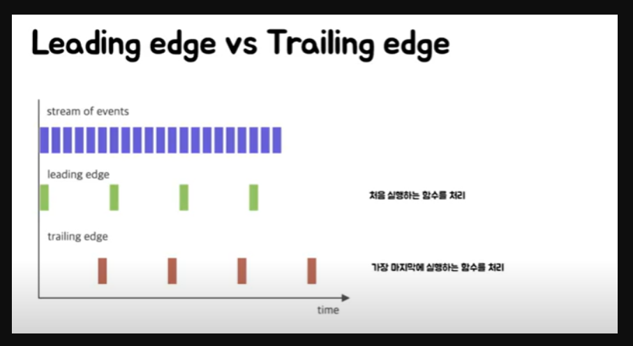

# 디바운싱
* 연이어 발생한 이벤트를 하나의 그룹으로 묶어서 처리하는 방식으로 주로 그룹에서 처음이나 마지막으로 싫애된 함수를 처리하는 방식으로 사용
* 웹에서 주로 ajax 검색에 자주 사용
* 주로 처음이나 마지막으로 실행된 함수를 처리하는 방식으로 사용

## 디바운스 사용 예시
* 사용자가 창 크기 조정을 멈출 때까지 기다렸다가 resizing event를 반영하고 싶을 때
* 사용자가 키보드 입력을 중지할 때까지 AJAX 이벤트를 발생시키지 않고 싶을 때

## Debounce 라이브러리
* Lodash debounce 함수 사용 권장


## 디바운싱 종류
1. leading edge: 처음에 실행한 함수를 실행하고 그 뒤의 이벤트를 무시함
  * 연속적으로 들어오는 입력중에 처음의 입력만 실행하게 하는 기법이다.
  * 제출을 누르는데 엔터로 꾹누르는 경우 처음의 요청만 보내고 뒤는 무시할수 있도록 하게 할때 사용한다.
2. trailing edge: 마지막에 실행한 함수를 실행하고 그 전의 이벤트를 무시함
  * 연속적으로 들어오는 입력중에 마지막 입력만 실행하게 하는 기법이다.
  * window의 resize이벤트에서 마지막 변할때만 실행시키고 싶다면 사용한다.  
  * input 입력할때마다 api 요청을 할때 사용한다.  




## 디바운싱 코드
```jsx
const $input = document.querySelector("#input");
const $app = document.querySelector("#app");

const callAjaxRequest = (e) => {
  $app.insertAdjacentHTML("beforeend", `<p>ajax 요청: ${e.target.value}</p>`);
};

const debounce = (func, wait, leading = false) => {
  let timer; // closure를 사용하여 timer 변수 초기화
  return (e) => {
    let callNow = leading && !timer; 

    const later = () => {
      timer = null;
      if (!leading) {
        func(e);
      }
    };

    clearTimeout(timer);
    timer = setTimeout(later, wait);

    if (callNow) {
      func(e);
    }
  };
};

$input.addEventListener("input", debounce(callAjaxRequest, 1000, true));
```


# 쓰로틀링
* 쓰로틀링은 출력을 조절한다는 의미를 가지고 있다   
* 프로그래밍에서 쓰로틀링은 이벤트를 일정 주기마다 발생하도록 하는 기술이다.


## 쓰로틀링 사용 예시
* 등록해놓은 스크롤 이벤트 리스너로 인해 성능 저하를 경험하고 싶지 않을 때 사용


## 쓰로틀링 코드
```jsx
const throttle = (func) => {
  let timer;

  return () => {
    if (!timer) {
      timer = setTimeout(() => {
        timer = null;
        func();
      }, 50);
    }
  };
};

$app.addEventListener("scroll", throttle(increaseCountNumber));
```


# 디바운싱과 쓰로틀링의 차이
* 디바운싱: 스크롤이 내리다가 스크롤을 멈추고 특정 시간 후 이벤트가 하나 발생한다
* 쓰로틀링: 이벤트가 하나 발생한 뒤 특정 시간동안 이벤트가 발생하지 않지만 그 시간이 지나면 다시 이벤트가 동작한다

둘다 입력을 제한한다는 점에서 유사해 보이지만 차이점이 있다.

일단 디바운싱은 주로 api통신을 할때 사용된다. 여러번 똑같은 요청을 하면 쓸모없는   
api 호출이 불러와지기 때문에 처음 한번 혹은 마지막 한번만 하게 한다.

반면 쓰로틀링은 성능최적화할때 사용된다. 스크롤 이벤트에 비용이 큰 이벤트 핸들러가 걸려있다고 생각해보자.   
스크롤 이벤트는 살짝만 내려도 수십개의 이벤트가 발생하는것을 볼수있다.   
이런곳에 비용이 큰 이벤트핸들러가 걸려있다면 당연히 성능에 문제가 생길수 밖에 없을것이다.  
그래서 사용하는것이 쓰로틀링이다.

그래서 디바운싱은 입력을 마치기전까지 내가 계속 입력을 하고있다면 무한히 그 입력이 무시되고  
쓰로틀링은 반드시 지정한 시간내에 한번은 실행하도록 보장을 해준다.


## debounce leading edge vs 스로틀링
디바운싱 leading edge는 스로툴링과 유사하게 작동한다  

차이점은 debouncing leading edge는 설정한 타이머 시간 안에 요청이 지속적으로 들어올 경우  
모든 요청을 무시하게 된다

반면에 throttling은 지속적으로 요청이 들어올 경우 정해진 타이머 시간이 지나면 요청을 허용한다


