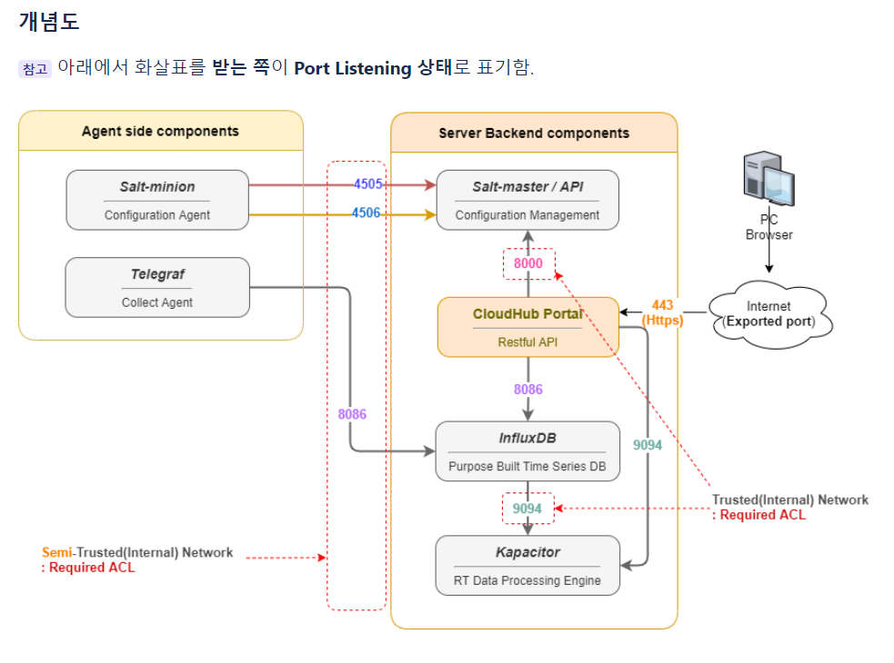

# [CloudHub](https://github.com/snetsystems/cloudhub)
* [개발 환경](https://github.com/jaegeunha94/ITStudy/tree/main/Project/CloudHub#cloudhub-%EA%B0%9C%EB%B0%9C-%ED%99%98%EA%B2%BD)
* [제품 설명](https://github.com/jaegeunha94/ITStudy/tree/main/Project/CloudHub#%EC%A0%9C%ED%92%88-%EC%84%A4%EB%AA%85)
* [서버 작업](https://github.com/jaegeunha94/ITStudy/tree/main/Project/CloudHub#%EC%84%9C%EB%B2%84-%EC%9E%91%EC%97%85)
* [Commit 내역](https://github.com/jaegeunha94/ITStudy/tree/main/Project/CloudHub#commit-%EB%82%B4%EC%97%AD)

 
 
 
 
 
 

# Cloudhub 개발 환경
## 1. IDE
### Visual Studio Code
* 1.74.2

## 2. 가상화
### Virtual Box
* VirtualBox-6.1.32-149290-Win

## 3. 운영체제
### CentOS
* CentOS-7-x86_64-DVD-2009
  * CentOS Linux release 7.9.2009 (Core)

## 4. 프론트
### node
* node-v12.22.1-x64

### React
* ^16.12.0

## 5. 백엔드
### go 
* 1.16.x

 
 

# 제품 설명
운영하고 있는 대상 장비 혹은 Cloud 솔루션

Bare metal 서버, IaaS, PaaS 솔루션 등의 가용성 데이터를 수집하고 시각화 하며,  
수집된 데이터를 사용자 tenant 별로 제공하기 위한 API를 제공하는데 주 목적이 있습니다.

## 수집 범위
* Bare metal 서버.
* IaaS: Red hat OpenStack, VMWare(vROps), Amazon Web Service EC2, Google Cloud Platform Compute Engine,

## 데이터 수집 방식 및 기본 개념
### Push 방식 데이터 수집:
수집 에이전트를 모니터링 대상 OS에 설치 후 데이터를 CloudHub 시계열 DB로 Push하는 방식, 흔히 Agent 방식으로고도 불림.  
주로, BM 서버, Azure HCI와 같이 내부 OS에 Agent를 설치하여 사용됨.

### Pull 방식 데이터 수집:
Collector 서버에서 수집 모듈이 Pull(Get) 방식으로 데이터를 수집하는 방식, 흔히 Agentless 방식으로고도 불림.
주로, OpenStack, OpenShift, VMWare(vROps), Tanzu 혹은 IPMI, SNMP 등과 같이  
Metrics 데이터를 수집할 수 있는 특정 API 혹은 프로토콜 등을 통하여 수집하는 경우에 사용됨.

# Cloudhub 제품 구성
## 1. SaltStack
인프라의 규모가 커질 수록 서버 설치와 설정에 대한 부담이 늘어날 때 (특히 트래픽이 급격히 늘어나는 경우)  
서버를 구축하기 위해서 대규모 인프라를 관리하기 위한 자동화 관리 시스템이다. 

### Salt-Master
* Saltstack에서 Server 역할을 담당한다. 
* Master는 등록된 Minion 에게 명령을 publishing 하고 그 결과를 취합하여 보여주는 역할이다.  
* 1대의 single master가 minion 수천대까지 관리 가능하다. 

### Salt-Minion
* Agent의 역할이며, 구성 자동화를 하기 위한 대상 서버에 설치하면 된다.  
* Master의 명령을 기다리고 있다가 명령이 오면 그에 맞춰 작업을 수행하게 된다. 
* 만약, 서버에 minion을 설치하기 어려운 상황이라면 Ansible 처럼 SSH로 명령 push가 가능하게도 지원된다.

### ZeroMQ
* Salt-master와 Salt-minion 간 통신에 ZeroMQ 라는 비동기 메시징 라이브러리를 사용한다.
* 따로 설치해야 하는 것은 아니며 Salt-master를 설치하면 zeroMQ도 함께 설치 된다. 
* publish Port로 4505 / Return Port 로 4506 을 사용한다. (포트 수정 가능)

## 2. Telegraf
* 데이터 수집 에이전트
* 플러그인을 기반으로 데이터 수집 가능

### Telegraf 플러그인 종류
#### Input Plugin
* collect metrics from the system, services, or 3rd party APIs

#### Processor Plugins 
* transform, decorate, and/or filter metrics

#### Aggregator Plugins 
* create aggregate metrics (e.g. mean, min, max, quantiles, etc.)

#### Output Plugins write metrics to various destinations
* write metrics to various destinations

## 3. InfluxDB 
* InfluxDB는 시계열 데이터베이스
* Time Seriese Data(시계열 데이터)는 시간에 따라 저장된 데이터
* 시계열 데이터베이스는 '하나 이상의 시간'과 '하나 이상의 값' 쌍을 통해 시계열을 저장하고 서비스하는데 최적화된 소프트웨어 시스템

## 4. Cloudhub
클라우드 허브 제품은 서버, 어플리케이션, 가상 머신, 쿠버네티스 등을 모니터링해주는 제품,  
또한 모니터링한 데이터를 시각화하여 보여주고 알람을 설정할 수 있음

# 모니터링 해본 장비
## Baremetal
* Dell장비
  * 에스넷시스템 인성정보
* Gigabyte 장비
* Inspur 장비
* Nvdia
  * DGX 장비

## IaaS
* Red hat OpenStack
* VMware(vROps).

## PaaS
* Red hat OpenShift
  * Kubernetes와 유사
* Tanzu.

## Public Cloud
* Azure HCI

# 서버 작업
## CentOS7
* [Gluster 구성(Replica)을 통해 Collector Server간 Minion 상태 공유](https://github.com/jaegeunha94/ITStudy/tree/main/OS/Linux/Gluster)

### NGinx
* [HTTP 2.0 적용](https://github.com/jaegeunha94/ITStudy/tree/main/Server/Nginx/Configuration#cloudhub-nginx-%EC%84%A4%EC%A0%95)
* [NGinx에 WebSocket용 옵션 설정](https://github.com/jaegeunha94/ITStudy/blob/main/Network/HTTP/Header/Upgrade/README.md#nginx-websocket-%ED%94%84%EB%A1%9C%ED%86%A0%EC%BD%9C-%EC%82%AC%EC%9A%A9-%EC%8B%9C-conf-%ED%8C%8C%EC%9D%BC-%EC%84%A4%EC%A0%95)
* [NGinx WebSocket Timeout로 인한 proxy_read_timeout 옵션 적용](https://github.com/jaegeunha94/ITStudy/tree/main/Server/Nginx/Configuration#7-proxy_read_timeout)

# Commit 내역
### [Add an input filter to telegraf test function on UI. #348](https://github.com/snetsystems/cloudhub/commit/d08b08427a597106c55971a5c2f2f07c8eeaac48)
* 변경 이유: Telegraf의 Input Plugin을 테스트 하고 싶은 경우, 전체 Input Plugin을 Test 하여 많은 시간이 소요됨 
* 변경 내용
  * 개별 Input Plugin을 테스트 할 수 있는 UI 추가

### [Prevent writing telegraf.conf file when conf file isn't changed in telegraf test. #348](https://github.com/snetsystems/cloudhub/commit/84baa90090b01306ba235de465362df956346c91)
* 변경 이유: Telegraf conf 파일이 변경되지 않았음에도, 파일을 덮어쓰는 API 요청이 들어가 시간이 지연됨
* 변경 내용: telegraf conf 파일 변경되지 않았을 때는 telegraf conf 파일 덮어쓰는 로직 삭제

### [Add the export/import function of topology map. #351](https://github.com/snetsystems/cloudhub/commit/313033480edf06bfac67720d66345221b5fd3f55)
* 변경 이유: Topology 내용을 다른 서버 혹은 Source에 옮기고 싶을 때, 많은 시간이 소요됨
* 변경 내용: Topology 내용을 파일로 export/import할 수 있는 UI 및 기능 추가

### [Move topology save button to the back of export button #351](https://github.com/snetsystems/cloudhub/commit/5be3cad4cbc03946523d0a54b84de02f1808fa25)
* 변경 내용: Topology 탭에 export 버튼 위치 변경

### [Change logics of Test and Apply buttons in Agent Configuration](https://github.com/snetsystems/cloudhub/commit/38c15fb53cc15767ed792ed04a59ab897fb3f643)
* 변경 이유
  * AgentConfiguration 화면에서 설정 파일을 적용할 경우 Telegraf 서비스를 restart 시키는 문제
* 변경 내용
  * AgentConfiguration 화면에서 설정 파일을 적용할 경우 Telegraf 서비스를 restart 시키는 것에서 reload로 변경

### [Add Toml Basic Toggle Radio Button in ServiceConfig](https://github.com/snetsystems/cloudhub/commit/717dc89f876480985dcd21ba1d02d4c2c23b2959)
* 변경 이유: ServiceConfig 화면에서 설정 파일을 수정할 때, 기존 Dropdown 방식 뿐만 아니라 직접 타이핑 해서 설정 파일을 수정하는 화면을 넣기 위함
* 변경 내용: ServiceConfig 탭의 토글 버튼 UI와 그에 맞는 기능 추가

### [Add testing cloud input plugin before writing telegraf conf file in ServiceConfig](https://github.com/snetsystems/cloudhub/commit/6488e96de9dc334e43fa7e3221b3751633134db3)
* 변경 이유: Telegraf 설정 파일을 적용하기 전에 테스트 로직을 실행하지 않으면, 잘못된 설정 파일이 적용됐을 경우 Telegraf 서비스 파일이 죽을 수 있음
* 변경 내용: Telegraf 설정 파일 적용 전, 테스트 성공시 Conf 파일 적용하는 로직 추가

### [Fix Telegraf test filename in AgentConfiguration](https://github.com/snetsystems/cloudhub/commit/f475386dfcd81a16c16cfbe54317a5cf9b2d7f15)
* AgentConfiguration 탭의 Telegraf Test File 명 변경

### [Fix Telegraf test filename in ServiceConfig](https://github.com/snetsystems/cloudhub/commit/16eb9c8b59ac5fc1cf13b690661863d55c0c2c1c)
* 변경 이유: Test용 Telegraf Conf 파일명에 TimeStamp를 추가하기 위함
* 변경 내용: ServiceConfig 탭의 Test용 Telegraf Conf File 명 변경

### [Fix Remove checking statusText when response status is 200 in ServiceConfig, AgentControl and GridLayoutRenderer](https://github.com/snetsystems/cloudhub/commit/46bf191c032f3f49b3920854e50f7083e2a5c823)
* 변경 이유: NGinx 적용 후 변경된 response status 값이 변경됨
* 변경 내용: API 요청시 상태값이 200인 경우 성공한 것으로 봄

### [Add Collector Server Filtering in AgentConfiguration, ServiceConfig](https://github.com/snetsystems/cloudhub/commit/645094cc662c54daf7e20e58ad3aea1842adbfb7)
* 변경 이유: AgentConfiguration 탭과 ServiceConfig 탭에서 특정 단어로 시작하는 host만 화면에 출력하기 위함
* 변경 내용: AgentConfiguration 탭과 ServiceConfig 탭에 Collector Server를 'ch-collector'로 시작하는 HostName으로 필터링하는 기능 추가

### [Add selecting IP feature in AgentMinions Console](https://github.com/snetsystems/cloudhub/commit/a067b0c2cf44b2a279b5ca5ac9dc72971d3d0430)
* 변경 이유: Agent Minions 탭에서 Console을 클릭할 때, 선택한 Host에서 사용하는 네트워크 인터페이스가 2개 이상일 경우 선택 할 수 있었으면 좋겠음 
* 변경 내용: Agent Minions 탭에서 Conosle을 클릭할 때 네트워크 인터페이스가 2개 이상일 경우 IP를 선택할 수 있는 Dropdown UI 추가

### [Modify API Multi Request Logic not to transfer the token of salt to the client](https://github.com/snetsystems/cloudhub/commit/702dfccde62bb4be69d296ee9cd67c11c4bc75e0)
* 변경 이유: API 요청시 Frontend 코드에서 token을 넣어 보내기 때문에, 개발자도구 Network 탭에서 token이 노출됨
* 변경 내용
  * Salt API를 Multi로 호출하는 함수 로직 수정
    * Salt API를 Single 요청하는 것 뿐만 아니라 Multi 요청할 때에도 payload에 token 값을 비워서 요청
    * Salt API를 Single로 요청하는 로직은 이미 수정

### [Add InsecureSkipVerify Option in Salt Reverse Proxy](https://github.com/snetsystems/cloudhub/commit/f4790f0375428c9f9c4b03f2158e774b85e4b10e)
* 변경 이유: Salt API를 사용할 때 개발자 인증서를 사용하기 때문에 인증서 Verify 작업을 Skip하는 로직이 필요 
* 변경 내용: Salt API 호출 시 HTTPS 적용에 개발자 인증서를 사용하기 때문에 InsecureSkipVerify 옵션을 넣어, 인증서 Verify 작업을 Skip하는 로직 추가

### [Add Support OS ToolTip in Collector Control Tab](https://github.com/snetsystems/cloudhub/commit/6478ca453aaf0f29c731484ada33c3efcafac75b)
* 변경 이유: Collector Control Tab 화면에서 지원하지 않는 운영체제가 있음
* 변경 내용: Collector Control Tab에서 OS 운영체제 지원 범위 알려주는 ToolTip UI 추가

### [Add Confirm Dialog Box when leaving infrastructure topology tab with unsaved data](https://github.com/snetsystems/cloudhub/commit/886a13bfef96e9e16dde0291e4aff66de7acbdae)
* 변경 이유: Infrastructure topology 수정 후 저장 버튼을 클릭하지 않고 페이지 이동 시 저장이 불가하므로, 사용자 UX개선을 위해 변경 필요
* 변경 내용: 브라우저에서 제공하는 window.confirm을 사용하여 페이지 전환 시, 변경 사항을 저장할 지 물어보는 것으로 수정
  * OK를 누를 경우 변경 사항 저장하고 페이지 이동
  * Cancel를 누를 경우 변경 사항 저장하지 않고 페이지 이동

### [Telegraf 분산 처리를 위한 Salt Target Minion 지정 기능 추가](https://github.com/snetsystems/cloudhub/commit/9bb3c083adcfad3982432ff0950f55597a529fd8)
* 변경 이유
  * Nginx를 이용하여 Salt 분산을 할 경우, telegraf configuration 파일이 어디에 생성되었는지 알 수 없음
* 변경 내용
  * 특정 Collector server에 telegraf conf 파일을 추가/삭제 필요
  * 변경 내용: Cloudhub 서버 옵션에 target minion을 추가하여 해당 Minion에 파일 생성

 ### [Dashboard 생성 시 정렬 기준(오름차순/내림차순) 추가](https://github.com/snetsystems/cloudhub/commit/96104820e92f495c82a0701cb1e22b45035e9c94)
 * 변경 이유
   * 대시보드를 생성할 때 정렬 기준을 선택할 수 없음
 * 변경 내용
   * Dashboard 정렬 기준 설정하는 UI 추가
   * Dashboard 정렬 기준 정하는 기능 추가
