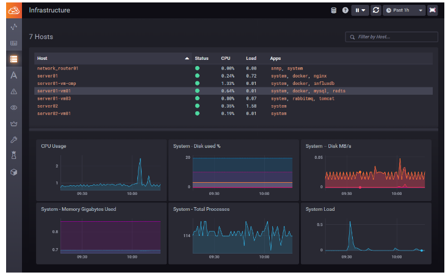

# ITStudy

# 📣 소개
공부한 내용을 정리하는 목적으로  
만들게 되었습니다.

대부분의 파일들은 
참조해서 온 내용들을   
그대로 정리하였습니다.

그 이유는 잘 모르는 개념들을  
내가 이해한 내용으로 바꾸려다
잘못된 개념을 학습할 수 있기 때문입니다.

이 깃허브의 최종 목표는
잘 정리된 자료들을 하나의 문서로 취합해가면서  
개념들을 정리해 나가는 것입니다.

# 📌Project

## [1. CloudHub](https://github.com/jaegeunha94/ITStudy/tree/main/Project/CloudHub)

---

# 🔎 카테고리
## 🔖알고리즘
[해시](https://github.com/jaegeunha94/ITStudy/tree/main/Algorithm/Hash)  

[시간복잡도](https://github.com/jaegeunha94/ITStudy/tree/main/Algorithm/Time%20Complexity)

## 🔖블록체인
[블록체인](https://github.com/jaegeunha94/ITStudy/tree/main/BlockChain)

## 🔖CS
[Block Non_block](https://github.com/jaegeunha94/ITStudy/tree/main/CS/Block_NonBlock)

[Encoding](https://github.com/jaegeunha94/ITStudy/tree/main/CS/Encoding)

## 🔖Docker
### Error
[IP Tables Failed Error](https://github.com/jaegeunha94/ITStudy/tree/main/Docker/Error/IPTables_Failed)

## 🔖Frontend
[Login](https://github.com/jaegeunha94/ITStudy/tree/main/Frontend/Login)

[Package Manager](https://github.com/jaegeunha94/ITStudy/tree/main/Frontend/PackageManager)

[Prettier](https://github.com/jaegeunha94/ITStudy/tree/main/Frontend/Code_Formatter/Prettier)

## 🔖Network
### HTTP
[Header - Upgrade](https://github.com/jaegeunha94/ITStudy/tree/090b4963b29b49c1f2d1f5e2f2ec6184d2cacb20/Network/HTTP/Header/Upgrade)

[HTTP 2.0](https://github.com/jaegeunha94/ITStudy/tree/main/Network/HTTP/HTTP2.0)

[IPsec](https://github.com/jaegeunha94/ITStudy/tree/main/Network/Security/IPsec)

[Socket](https://github.com/jaegeunha94/ITStudy/tree/main/Network/Socket)

## 🔖OS
### 리눅스
[링크](https://github.com/jaegeunha94/ITStudy/tree/main/OS/Linux/Link)

[서비스](https://github.com/jaegeunha94/ITStudy/tree/main/OS/Linux/Service)

#### CentOS7
[hostname](https://github.com/jaegeunha94/ITStudy/tree/main/OS/Linux/CentOS7/hostname)

#### Ubuntu
[bash](https://github.com/jaegeunha94/ITStudy/tree/main/OS/Linux/Ubuntu/Bash)

## 🔖Programming Language
### Javascript
[Throttling & Debouncing](https://github.com/jaegeunha94/ITStudy/tree/d3dc5e6d74de5094b3df649fd91d8ff5b07d29f0/ProgrammingLanguage/Javascript/Throttling_Debouncing)

